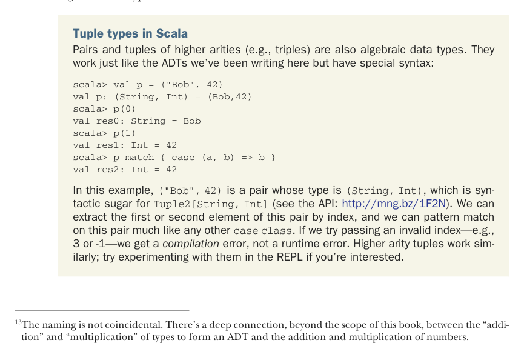

# Страница 0079

[<- Страница 0078](./page-0078) | [Указатель страниц](./) | [Страница 0080 ->](./page-0080)

> Часть 1: Введение в функциональное программирование / Глава 3: Функциональные структуры данных / 3.4 Деревья


#### УПРАЖНЕНИЕ 3.24

*Жёсткое*: Напиши `hasSubsequence`, чтоб проверял, есть ли в `List` другая `List` как подпоследовательность. 
Скажем, `List(1,2,3,4)` содержит `List(1,2)`, `List(2,3)` и `List(4)` среди прочего. 
Запаришься с кратким чисто функциональным вариантом, который ещё и не тормозит как черепаха на кофе — ну и хуй с ним, пиши как в душу ляжет. 
В пятой главе вернёмся, подкрутим, чтоб в прод не стыдно было пихать. 
Кстати, любые два значения `x` и `y` сравни на равенство через `x == y` — Scala сама разберётся.

```scala
def hasSubsequence[A](sup: List[A], sub: List[A]): Boolean
```

### 3.4 Деревья

`List` — классический пример *алгебраического типа данных* (ADT). 
(Блядь, запутанно: ADT иногда юзают для *абстрактного типа данных*, но мы-то не путаемся.) 
ADT — это тип, слепленный из одного или нескольких конструкторов данных, каждый как Lego-блок с нуля или кучей аргументов внутри. 
Тип — это *сумма* (или|или) своих конструкторов, а конструктор — *произведение* (и*и) аргументов. 
Отсюда и *алгебраический*, короче, математика в коде, чтоб не ебаться с мутабельным говном.<sup>13</sup>



#### Кортежи в Scala

Пары и кортежи повыше аритетности (типа троек) — тоже ADT под капотом. 
Работают в точь-в-точь как наши самопальные, но с сахарным синтаксисом, чтоб пальцы не стирать:

```scala
scala> val p = ("Bob", 42)
val p: (String, Int) = (Bob,42)
scala> p(0)
val res0: String = Bob
scala> p(1)
val res1: Int = 42
scala> p match { case (a, b) => b }
val res2: Int = 42
```

Тут `("Bob", 42)` — пара типа `(String, Int)`, что сахар для `Tuple2[String, Int]` (API глянь: http://mng.bz/1F2N). 
Вытащить первый или второй — по индексу, паттерн-матчить как нативный `case class`. 
Кинешь кривой индекс, типа 3 или -1 — компилятор в ебало даст ошибку, а не runtime-бум на проде. 
Кортежи подлиннее — так же, поэкспериментируй в REPL (Read-Eval-Print Loop), если жопа чешется.

<sup>13</sup>Название не с потолка. Есть глубокая связь (за рамками книги) между "сложением" и "умножением" типов в ADT и тем же с числами — чистая алгебра, братцы.

[<- Страница 0078](./page-0078) | [Указатель страниц](./) | [Страница 0080 ->](./page-0080)
