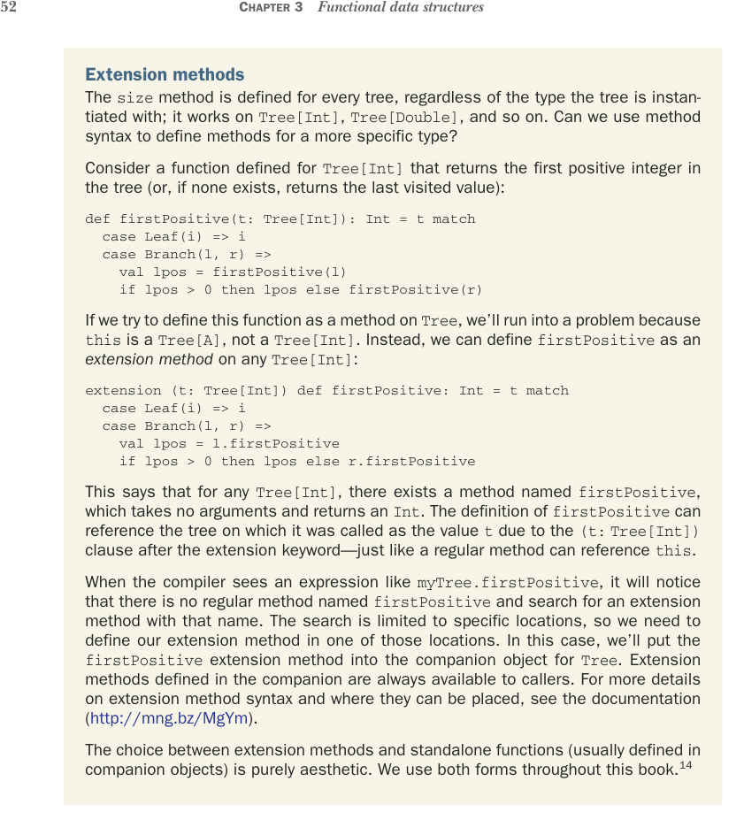

# Страница 0081
[<- Страница 0080](./page-0080) | [Индекс страниц](./) | [Страница 0082 ->](./page-0082)

> Часть 1: Введение в функциональное программирование / Глава 3: Функциональные структуры данных / 3.4 Деревья



Методы-расширения Метод `size` определён для любого дерева, хуй с ним, какой тип там висит — работает на `Tree[Int]`, `Tree[Double]` и прочей херне. А можно ли синтаксисом методов навешать фичу под конкретный тип, чтоб не ебаться с обобщениями?

Представьте функцию для `Tree[Int]`, которая рыщет по дереву и вытаскивает первый положительный инт (а если нихуя такого нет — кидает последнее посещенное значение, чтоб не срать пустышкой):

```scala
def firstPositive(t: Tree[Int]): Int = t match
case Leaf(i) => i
case Branch(l, r) =>
val lpos = firstPositive(l)
if lpos > 0 then lpos else firstPositive(r)
```

Если попробуем запихнуть эту хуйню как метод прямо на `Tree`, компилятор обосрётся: `this` же это `Tree[A]`, а не `Tree[Int]`. Вместо этого объявляем `firstPositive` как *метод-расширение* для любого `Tree[Int]`:

```scala
extension (t: Tree[Int]) def firstPositive: Int = t match
case Leaf(i) => i
case Branch(l, r) =>
val lpos = l.firstPositive
if lpos > 0 then lpos else r.firstPositive
```

Это значит: для любого `Tree[Int]` есть метод `firstPositive` без аргументов, который возвращает `Int`. В теле `firstPositive` дерево, на котором вызвали, светится как `t` — благодаря магическому `(t:` `Tree[Int])` после extension, как в обычном методе `this` под задницей.

Когда компилятор жуёт `myTree.firstPositive`, он не находит родного метода `firstPositive` и лезет по extension'ам в строго отведённых местах. Мы закинем `firstPositive` в companion-объект `Tree` — оттуда всегда на связи, как паблик-метод. Подробности синтаксиса и где их можно пихать — в доке (http://mng.bz/MgYm).

Выбор между методами-расширениями и standalone-функциями (обычно в companion'е) — чисто эстетика, как выбрать между пивом и водкой. В книге юзаем оба подхода.14

14

14В общем, объектно-ориентированный стиль юзаем, где есть один главный операнд (типа `firstPositive` на цели `Tree[Int]` или `map` на `Tree[A]`), а иначе — голая функция.

[<- Страница 0080](./page-0080) | [Индекс страниц](./) | [Страница 0082 ->](./page-0082)
