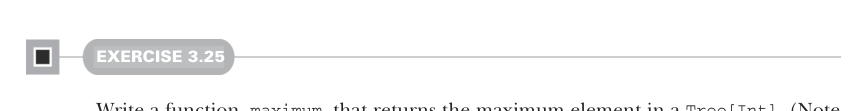
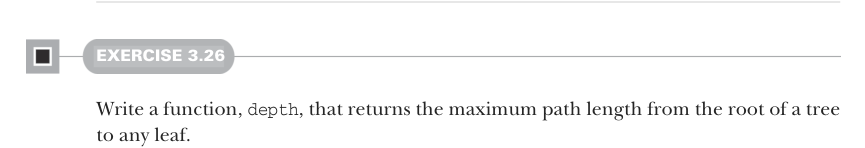
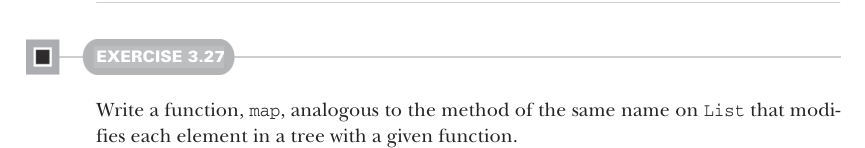
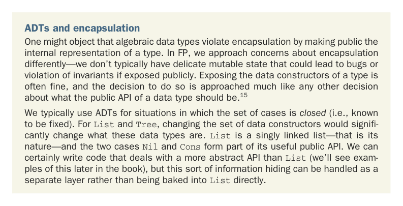

# Страница 0082
[<- Страница 0081](./page-0081) | [Индекс страниц](./) | [Страница 0083 ->](./page-0083)

> Часть 1: Введение в функциональное программирование / Глава 3: Функциональные структуры данных / 3.4 Деревья

## 53 3.4 Деревья

#### УПРАЖНЕНИЕ 3.25

Напиши функцию `maximum`, которая возвращает максимальный элемент в `Tree[Int]`.  
(Заметим, что в Scala можно использовать `x.max(y)`, чтоб вычислить максимум двух интов `x` и `y`.)  
Давай замутим ещё пару функций, пока разогнались.

#### УПРАЖНЕНИЕ 3.26

Напиши функцию `depth`, которая возвращает максимальную длину пути от корня дерева до любого листа.  
Представь, что дерево — это такая пирамида из пива, и тебе нужно найти самую длинную цепочку до дна.

#### УПРАЖНЕНИЕ 3.27

Напиши функцию `map`, аналогичную методу с таким же именем в `List`, которая модифицирует каждый элемент дерева с помощью заданной функции.  
Типа, map'а для дерева — чтоб не мучаться с рекурсией вручную.

ADT-шки (algebraic data types, алгебраические типы данных) и инкапсуляция. Кто-то может взвизгнуть, что алгебраические типы данных насрут в штаны инкапсуляции, выставляя напоказ внутреннюю кухню типа. В FP мы к этому подходим по-другому — у нас нет такого нежного мутабельного состояния, которое взорвётся от косого взгляда или сломает инварианты, если его палить на публику. Выставлять конструкторы данных типа — часто норм тема, и решение это принимается как любое другое по поводу публичного API. Типа, "а чё прятать, если оно и так чистое?"[^15]

Обычно ADT-шки юзаем, когда набор случаев *закрыт* (то есть, зафиксирован и не меняется). Для `List` и `Tree` — если поменять конструкторы, то тип вообще другим станет, как список без `Nil` и `Cons`. `List` — это односвязный список, и его суть в этих двух кейсах `Nil` и `Cons`, которые и составляют его годный публичный API. Конечно, можно кодить с более абстрактным API, чем сырые `List` (примеры увидишь позже в книге), но такое сокрытие инфы лучше слоить отдельно, а не запекать прямо в `List`, чтоб не плодить опечатки.

[^15]: В Scala ещё можно выставить паттерны вроде `Nil` и `Cons` независимо от реальных конструкторов данных типа — гибкость на уровне.

[<- Страница 0081](./page-0081) | [Индекс страниц](./) | [Страница 0083 ->](./page-0083)
