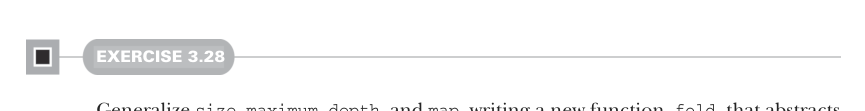

# Страница 0083
[<- Страница 0082](./page-0082) | [Индекс страниц](./) | [Страница 0084 ->](./page-0084)

> Часть 1: Введение в функциональное программирование / Глава 3: Функциональные структуры данных / 3.4 Деревья



#### УПРАЖНЕНИЕ 3.28

Обобщите ``size``, ``maximum``, ``depth`` и ``map``, слепив новую функцию ``fold``, которая вытянет их общий паттерн на чистую воду. Перепишите их все через эту универсальную хрень. А теперь подумайте: не напоминает ли эта ``fold`` левые и правые фолды для ``List``? Типа, рекурсивно жрёт дерево слева направо или справа налево, как в листе, только с ветками вместо хвоста?


**Enums против sealed traits** Пацаны, мы эти алгебраические типы данных ``List`` и ``Tree`` слепили на фише ``enum`` из Scala. Но можно и по-старому, через sealed traits — так и ковырялись в Scala 2, где enum'ов не было, и все через это дерьмо прошли, как я 16 лет назад.

``trait`` — это абстрактный интерфейс с общими методами (или значениями, или типами членов). Traits чисто абстрактные, их не инстанциируешь как значения — только через подтипы, как через прокси.

Класс (или объект) extends такой trait, и каждый его экземпляр — полноценный инстанс трейта. В них и абстрактные, и конкретные методы лепятся, а в Scala 3 ещё и параметры добавили (`http://mng.bz/XrYa`), так что они почти как abstract class, только гибче. Класс может extends кучу traits, но abstract class — только одну. Есть мелкие подвохи, но для нашей книги похуй (детали тут: `https://mng.bz/Xaa1`).

ADT на sealed trait строится так: перечисляешь конструкторы данных как подтипы трейта, обычно case class'ы и case object'ы в companion object'е трейта. Модификатор ``sealed`` заставляет всех подтипов сидеть в том же исходнике — критично для ADT, чтоб рандомные уроды не лепили новые конструкторы, иначе все твои pattern match'и наебнутся в проде. Компилятор даже проверит на код-ревью: все ли кейсы закрыты, и выдаст варнинг, если где-то дыра. Вот как выглядит sealed-версия ``List``, чисто для сравнения, чтоб понять, почему enum'ы — это upgrade:

```scala
sealed trait List[+A]:
import List.{Cons, Nil}
def size: Int = this match
case Cons(_, tl) => 1 + tl.size
case Nil => 0
object List:
case class Cons[+A](head: A, tail: List[A]) extends List[A]
case object Nil extends List[Nothing]
```

[<- Страница 0082](./page-0082) | [Индекс страниц](./) | [Страница 0084 ->](./page-0084)
