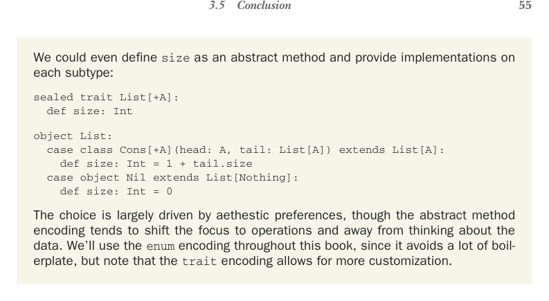

# Страница 0084
[<- Страница 0083](./page-0083) | [Индекс страниц](./) | [Страница 0085 ->](./page-0085)

> Часть 1: Введение в функциональное программирование / Глава 3: Функциональные структуры данных / 3.5 Заключение



## 3.5 Заключение

Можем, блядь, даже `size` как абстрактный метод завести и в каждом подтипе по-своему реализовать:

```scala
sealed trait List[+A]:
  def size: Int

object List:
  case class Cons[+A](head: A, tail: List[A]) extends List[A]:
    def size: Int = 1 + tail.size
  case object Nil extends List[Nothing]:
    def size: Int = 0
```

Выбор тут чисто по эстетике, как в споре о том, где табуляция, а где пробелы, но абстрактный метод уводит фокус на операции, а данные как бы отходит на второй план. По всей книге пойдём с `enum` — меньше boilerplate'а, меньше слёз по вечерам, но имей в виду, `trait` даёт больше простора для кастомизации, если вдруг припрёт.

### Резюме

- Функциональные структуры данных — неизменяемые (immutable) по определению, ковыряешь их только чистыми функциями, без мутабельного дерьма и побочек.
- Алгебраические типы данных (ADT) собираются из набора конструкторов данных, как Lego для типов.
- В Scala ADT выражаются через перечисления (enum) или sealed trait'ы (sealed traits) — иерархии, где компилятор всех на контроле держит.
- Перечисления могут жрать параметры типов, а каждый конструктор — ноль или больше аргументов, гибкость полная.
- Односвязный список моделируем как ADT с двумя конструкторами: `Cons(head: A, tail: List[A])` и `Nil` — классика, без изысков.
- Компаньон-объекты (companion objects) — это объекты с тем же именем, что и тип, имеют доступ к приватным и protected мемберам компаньона, как братаны в банде.
- Паттерн-матчинг разбирает ADT на молекулы, чтоб значения конструкторов прощупать — destructure как по маслу.
- Матчинг можно сделать исчерпывающим — всегда какой-то кейс сработает. Несовершенный может выкинуть `MatchError`, компилятор обычно орёт предупреждением, чтоб не облажался.
- Чисто функциональные структуры юзают persistence (персистентность), он же structural sharing (структурное совместное использование), — копировать заново не ебёмся, шарингим структуру, экономим как в кризисе.

[<- Страница 0083](./page-0083) | [Индекс страниц](./) | [Страница 0085 ->](./page-0085)
