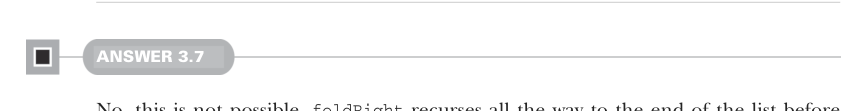

# Страница 0088
[<- Страница 0087](./page-0087) | [Индекс страниц](./) | [Страница 0089 ->](./page-0089)

> Часть 1: Введение в функциональное программирование / Глава 3: Функциональные структуры данных / 3.6 Ответы на упражнения

## 59 3.6 Ответы на упражнения

Эта реализация жрёт стек-фрейм на каждый элемент списка — и привет, StackOverflowError (ошибка переполнения стека) для списков покрупнее, как в том меме про рекурсию без хвоста. Скоро разберём, как рекурсию писать без этой кучи фреймов в стеке, чтоб не краснеть перед продом.



#### ОТВЕТ 3.7

Нет, это не прокатит. `foldRight` докурсится до самого жопа списка, прежде чем пальцем шевельнёт и вызовет твою функцию. Полный трейверсал (traversal) случится, пока ты моргнёшь. Ранний выход из рекурсии — это уже в 5-й главе, не торопись.


#### ОТВЕТ 3.8

`foldRight(List(1, 2, 3), Nil: List[Int], Cons(_, _))` вычисляется в `Cons(1, Cons(2, Cons(3, Nil)))`. Вспомни, `foldRight(as, acc, f)` подменяет `Nil` на `acc` и `Cons` на `f`. Когда аккамулятор = `acc` = `Nil`, а `f` = `Cons`, все подмены — чистые идентитеты, без подвоха, как в том код-ревью, где всё на месте.


#### ОТВЕТ 3.9

```scala
def length[A](as: List[A]): Int =
  foldRight(as, 0, (_, acc) => acc + 1)
```

Кидаем в `foldRight` стартовый аккамулятор 0 и лямбду, которая за каждый встреченный элемент плюсует 1 к аккамулятору. Классика жанра для подсчёта длины — я сам через это прошёл, когда `foldLeft` стал моим лучшим другом.


#### ОТВЕТ 3.10

```scala
@annotation.tailrec
def foldLeft[A, B](as: List[A], acc: B, f: (B, A) => B): B =
  as match
    case Nil => acc
    case Cons(hd, tl) => foldLeft(tl, f(acc, hd), f)
```

Паттерн-матчим на входящем списке: если `Nil` — сливаем накопленный результат; если `Cons` — новый_акк = `f`(текущий_акк, head из ячейки `Cons`), потом рекурсивно `foldLeft`(tail, новый_акк). Это чистая хвостовая рекурсия — после рекурсивного вызова больше хуйни не остаётся. Компилятору Scala напоминаем аннотацией `@annotation.tailrec`, чтоб не ныл и оптимизировал как tail call (хвостовый вызов), а то сам знаешь, как оно без неё.

[<- Страница 0087](./page-0087) | [Индекс страниц](./) | [Страница 0089 ->](./page-0089)
