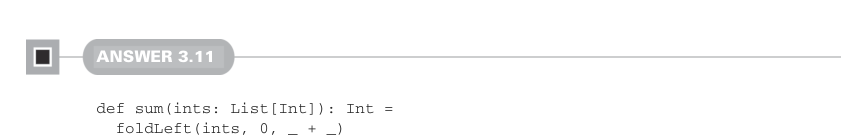
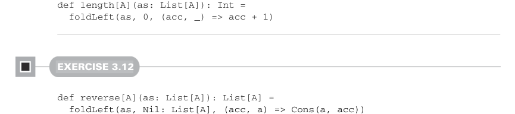

# Страница 0089
[<- Страница 0088](./page-0088) | [Индекс страниц](./) | [Страница 0090 ->](./page-0090)

> Часть 1: Введение в функциональное программирование / Глава 3: Функциональные структуры данных / 3.6 Ответы на упражнения



#### Ответ 3.11

```scala
def sum(ints: List[Int]): Int =
  foldLeft(ints, 0, _ + _)

def product(ds: List[Double]): Double =
  foldLeft(ds, 1.0, _ * _)
```



```scala
def length[A](as: List[A]): Int =
  foldLeft(as, 0, (acc, _) => acc + 1)
```

#### Упражнение 3.12

```scala
def reverse[A](as: List[A]): List[A] =
  foldLeft(
    as,
    Nil: List[A],
    (acc, a) => Cons(a, acc)
  )
```

Мы юзаем `foldLeft` с начальным аккамулятором в виде пустого списка и `Cons(a, acc)` как 
комбайнирующую функцию. Из-за того, что `foldLeft` прёт по элементам слева направо, 
список на выходе собирается справа налево — чистый реверс, как по маслу, без лишнего 
говна в памяти.


#### Ответ 3.13

Простая и stack-safe (безопасная для стека) имплементация `foldRight` делает два прохода 
по `List`:

```scala
def foldRightViaFoldLeft[A, B](as: List[A], acc: B, f: (A, B) => B): B =
  foldLeft(reverse(as), acc, (b, a) => f(a, b))
```

Сначала реверсим входной список, а потом `foldLeft` с результатом, но с переставленными 
параметрами в комбайнере — классика, пацаны, два прохода, но без риска stack overflow 
(переполнения стека), как в том меме про рекурсию без хвоста. Есть и другой трюк, чисто 
для теории, работает так же охуенно по `foldRight` в плане `foldLeft` и по `foldLeft` 
в плане `foldRight`. Фишка в том, чтобы аккамулировать не одно значение типа `B`, а 
функцию `B => B`. В обоих случаях стартуем с идентитной функцией на типе `B`: 
`(b: B) => b`. Когда имплементим `foldRight` через `foldLeft` с аккамулятором типа 
`B => B`, комбайнер для `foldLeft` выходит с типом `(B => B, A) => (B => B)`. 
Это функция двух аргументов: первый — функция из `B` в `B`, второй — сам `A`. 
А возвращает новую функцию из `B` в `B`. Голова кругом, да? Давайте типы разложим 
по полочкам. Наш комбайнер будет выглядеть так: `(g: B => B, a: A) => ???: (B => B)`. 
Поскольку нам нужно вернуть

[<- Страница 0088](./page-0088) | [Индекс страниц](./) | [Страница 0090 ->](./page-0090)
