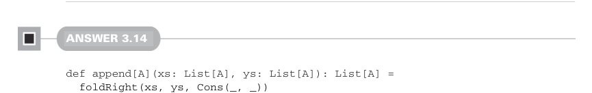
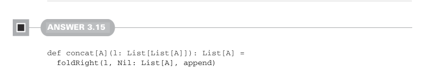

# Страница 0090
[<- Страница 0089](./page-0089) | [Индекс страниц](./) | [Страница 0091 ->](./page-0091)

> Часть 1: Введение в функциональное программирование / Глава 3: Функциональные структуры данных / 3.6 Ответы на упражнения

## 61 Ответы на упражнения 3.6

Для функции от `B` к `B` лепим анонимную фичу — как матрёшку из лямбд.  
Разворачиваем эту хрень, и вуаля:  
`(g: B => B, a: A) => (b: B) => ???: B`.  

Типы сами пляшут дальше: у нас `a: A`, `b: B`, ф-я `g: B => B` и ф-я `f: (A, B) => B`.  
Пихаем `a` и `b` в эту конструкцию, а результат — в `f`, а потом к `g`.  
Собираем пазл — и вот наша имплементация, пацаны:

```scala
def foldRightViaFoldLeft[A, B](as: List[A], acc: B, f: (A, B) => B): B =
foldLeft(as, (b: B) => b, (g, a) => b => g(f(a, b)))(acc)
```

Обратите внимание, результат  
`foldLeft(as, (b: B) => b, (g, a) => b => g(f(a, b)))`  
выдаёт финальную ф-ю типа `B => B`.  
Плюсуем начальный `acc` — и получаем итог `B`.  
Тот же трюк валим для `foldLeft` через `foldRight`, без вопросов:

```scala
def foldLeftViaFoldRight[A, B](as: List[A], acc: B, f: (B, A) => B): B =
foldRight(as, (b: B) => b, (a, g) => b => g(f(b, a)))(acc)
```

Но эти хитрые хаки не stack-safe (безопасные относительно стека), бля — композиция ф-й сама по себе не такая, каждый проход комбайнера наращивает аккумулятор новой лямбдой, как снежный ком из анонимок, и стек в итоге бабахнет. Я сам на этом в 2012-м обжёгся, JVM аж вспотела. Но это намекает на глубокий дзен, который мы раскопаем в 10-й главе, держитесь.



#### ОТВЕТ 3.14

```scala
def append[A](xs: List[A], ys: List[A]): List[A] =
foldRight(xs, ys, Cons(_, _))
```

Вспомните, `foldRight` меняет `Nil` на начальный аккумулятор.  
Значит, в первом листе подменяем `Nil` целиком вторым списком — бам, и готово.



#### ОТВЕТ 3.15

```scala
def concat[A](l: List[List[A]]): List[A] =
foldRight(l, Nil: List[A], append)
```

Склеиваем каждый вложенный листок с накопленным `List[A]` через нашу `append` из 3.14 — просто, чисто и без говна.


#### ОТВЕТ 3.16

```scala
def incrementEach(l: List[Int]): List[Int] =
foldRight(l, Nil: List[Int], (i, acc) => Cons(i + 1, acc))
```

[<- Страница 0089](./page-0089) | [Индекс страниц](./) | [Страница 0091 ->](./page-0091)
