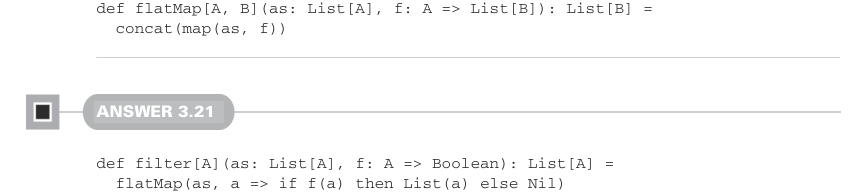

# Страница 0092
[<- Страница 0091](./page-0091) | [Индекс страниц](./) | [Страница 0093 ->](./page-0093)

> Часть 1: Введение в функциональное программирование / Глава 3: Функциональные структуры данных / 3.6 Ответы на упражнения

## 63 3.6 Ответы на упражнения



```scala
def flatMap[A, B](as: List[A], f: A => List[B]): List[B] =
concat(map(as, f))
```

#### Ответ 3.21


```scala
def filter[A](as: List[A], f: A => Boolean): List[A] =
flatMap(as, a => if f(a) then List(a) else Nil)
```

#### Ответ 3.22

```scala
def addPairwise(a: List[Int], b: List[Int]): List[Int] = (a, b) match
case (Nil, _) => Nil
case (_, Nil) => Nil
case (Cons(h1, t1), Cons(h2, t2)) => Cons(h1 + h2, addPairwise(t1, t2))
```

Мы берём наши входные списки, склеиваем их в пару и патчим на результат — классика жанра, как в старом добром Lisp'е, только без скобочного ада. 

Если хоть один список пустой — сразу сливаем пустой список, чтоб не ебаться зря. 

Иначе оба — это `Cons`-ячейки, биндим имена на головы (`h1` и `h2`) и хвосты (`t1` и `t2`), а потом лепим новую `Cons`-ячейку: голова — это `h1` `+` `h2`, а хвост — рекурсивный вызов `addPairwise` на хвостах. 

Но вот засада: эта реализация не хвостовая рекурсия (tail recursion), потому что результат рекурсии потом юзаем для сборки `Cons`-ячейки — стек будет расти, как снежный ком в аду, пока не StackOverflow'нёт. Помните те времена на код-ревью?


#### Ответ 3.23

```scala
def zipWith[A, B, C](a: List[A], b: List[B], f: (A, B) => C): List[C] =
(a, b) match
case (Nil, _) => Nil
case (_, Nil) => Nil
case (Cons(h1, t1), Cons(h2, t2)) => Cons(f(h1, h2), zipWith(t1, t2, f))
```

Здесь мы сделали две крутые обобщения, чтоб не писать одно и то же по сто раз, как лохи в imperative-мире: 

во-первых, вынесли операцию `+` в отдельную функцию и сунули её параметром в `zipWith`, 

а во-вторых, разрешили спискам иметь разные типы — полная свобода, блядь. 

Поэтому нужны три типа-параметра: по одному на входные списки и один на результирующий. 

А чтоб не словить StackOverflow на больших списках (мы ж не самоубийцы), передаём аккумулятор прямо в рекурсивный вызов, вместо "сначала рекурсия, потом юзаем результат" — это как апгрейд от велосипедной цепи к турбине, stack-safe (стек-безопасная) на все сто:

```scala
def zipWith[A, B, C](a: List[A], b: List[B], f: (A, B) => C): List[C] =
@annotation.tailrec
def loop(a: List[A], b: List[B], acc: List[C]): List[C] =
(a, b) match
case (Nil, _) => acc
case (_, Nil) => acc
case (Cons(h1, t1), Cons(h2, t2)) => loop(t1, t2, Cons(f(h1, h2), acc))
reverse(loop(a, b, Nil))
```

[<- Страница 0091](./page-0091) | [Индекс страниц](./) | [Страница 0093 ->](./page-0093)
