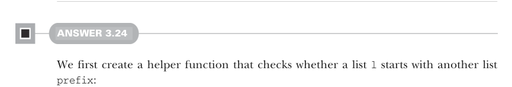
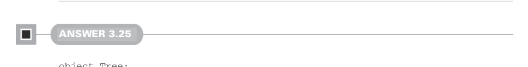

# Страница 0093
[<- Страница 0092](./page-0092) | [Индекс страниц](./) | [Страница 0094 ->](./page-0094)

> Часть 1: Введение в функциональное программирование / Глава 3: Функциональные структуры данных / 3.6 Ответы на упражнения

Здесь мы впихнули локальную функцию `loop`, которая жрёт дополнительный аргумент `acc` типа `List[C]`. Когда рекурсим, пихаем `Cons(f(h1, h2), acc)` как новый аккумулятор — типа как наваливаем слои в бутерброд, но снизу вверх. В итоге аккумулятор выходит перевёрнутым, как носки после экстремальной стирки в продакшене, поэтому перед возвратом из `zipWith` его реверсим, чтоб не позориться.



#### ОТВЕТ 3.24

Сначала лепим хелпер, который проверяет, начинается ли список `l` с другого списка `prefix`:

```scala
@annotation.tailrec
def startsWith[A](l: List[A], prefix: List[A]): Boolean = (l, prefix) match
  case (_, Nil) => true
  case (Cons(h, t), Cons(h2, t2)) if h == h2 => startsWith(t, t2)
  case _ => false
```

Рекурсим по структуре обоих списков, как два танцора в парном танце. Если префикс — `Nil`, то `l` тривиально начинается с него, даже если `l` — бесконечный мем про Nil. Иначе: головы равны? Если да — рекурсим по хвостам, как в матрёшке. С этим хелпером `startsWith` собираем `hasSubsequence`:

```scala
@annotation.tailrec
def hasSubsequence[A](sup: List[A], sub: List[A]): Boolean =
  sup match
    case Nil => sub == Nil
    case _ if startsWith(sup, sub) => true
    case Cons(h,t) => hasSubsequence(t, sub)
```

Паттерн-матчим по структуре `sup`. Если `sup` пустой — `true`, только если `sub` тоже пустой (типа, вакуум в вакууме), иначе `false`. Если `sup` жирный, сначала проверяем `startsWith(sub)` — если да, то пиздец, мы нашли, возвращаем `true`; нет — рекурсим по хвосту, выискивая `sub` как подпоследовательность, чтоб не упустить ни одной подлянки.



#### ОТВЕТ 3.25

```scala
object Tree:
  extension (t: Tree[Int])
    def maximum: Int = t match
      case Leaf(n) => n
      case Branch(l, r) => l.maximum.max(r.maximum)
```

Лепим extension-метод на `Tree[Int]` прямо в компаньоне `Tree` — классика, чтоб не мучиться с импортами. Паттерн-матчим по конструкторам `t`: листок? Максимум — его значение, тривиально, как 42 в ответах Дугласа Адамса. Ветка? Макс из левого и правого — берём жирнее, как в фитнесе. Ах да, это не хвостовая рекурсия, так что на глубоких деревьях стек может обосраться, но для упражнения сойдёт, пацаны.

[<- Страница 0092](./page-0092) | [Индекс страниц](./) | [Страница 0094 ->](./page-0094)
