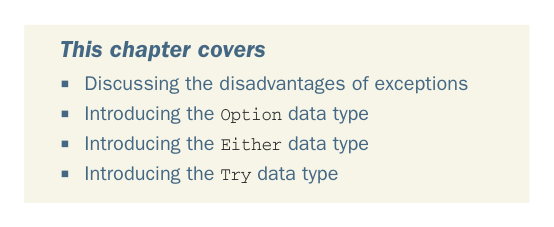

# Страница 0096

[<- Страница 0095](./page-0095) | [Указатель страниц](./) | [Страница 0097 ->](./page-0097)

> Часть 1: Введение в функциональное программирование / Глава 4: Обработка ошибок без исключений

## Обработка ошибок без исключений

### В этой главе мы разберём

- Разбор недостатков исключений, этих гранат в функциональной комнате
- Знакомство с типом данных `Option`
- Знакомство с типом данных `Either`
- Знакомство с типом данных `Try`

В первой главе мы уже вскользь отметили, что выкидывание исключений — это побочный эффект чистой воды, как пердёж в лифте на код-ревью. Если в функциональном коде исключения под запретом, то чем их заменять, блядь? В этой главе разберём базовые принципы поднятия и обработки ошибок по-функциональному. Главная фишка — представлять провалы и эксепшены обычными значениями, а не летящими по стеку дротиками. Пишем высшие функции, которые выдирают общие паттерны обработки и восстановления, как универсальный try-catch на стероидах. Функциональный подход с возвратом ошибок как значений — это safer space, сохраняет референциальную прозрачность (никаких сюрпризов, как в imperative аду), и через HOFы мы цепляемся за главный плюс эксепшенов: *консолидацию логики обработки ошибок*. Я сам через это прошёл — сначала эксепшены жрал как чипсы, потом осознал подвох. Посмотрим, как это работает, после того как ближе разберём исключения и их классические косяки.

**67**

[<- Страница 0095](./page-0095) | [Указатель страниц](./) | [Страница 0097 ->](./page-0097)
