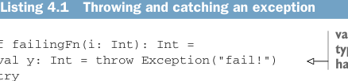

# Страница 0097
[<- Страница 0096](./page-0096) | [Индекс страниц](./) | [Страница 0098 ->](./page-0098)

> Часть 1: Введение в функциональное программирование / Глава 4: Обработка ошибок без исключений / 4.1 Хорошие и плохие стороны исключений

По той же причине, по которой мы слепили свой `List` в прошлой главе — чтоб въехать в суть, а не просто копипастить, — здесь мы перепишем две стандартные типы из Scala-библиотеки: `Option` и `Either`. Цель — чтобы вы реально прониклись, как эти типы юзаются для обработки ошибок без пиздеца. После этой главы смело хватайте стандартные версии `Option` и `Either` из стандбиба (хотя заметите, что там нет тех жирных функций, которые мы тут нарисуем, — классика, бля, Scala-стандарт всегда чуть-чуть обрезан, как пиратский диск).

### 4.1 Хорошие и плохие стороны исключений

Почему исключения referential transparency (RT, ссылочную прозрачность) в жопу ебут, и почему это такая хуйня? Давайте разберём на простом примере, пацаны; определим функцию, которая exception кидает, и вызовем её — чисто как в продакшене, когда оно бабахнет.

Листинг 4.1. Кидание и ловля исключения



> `val y: Int = …` объявляет `y` типа `Int` и приравнивает к правой стороне `=`.

```scala
def failingFn(i: Int): Int =
val y: Int = throw Exception("fail!")
try
val x = 42 + 5
x + y
catch
```


> Блок `catch` — это просто паттерн-матчинг (pattern matching), как те, что мы уже видели.  
> `case e: Exception` — паттерн, который матчит любой `Exception` и биндит его к идентификатору `e`.  
> `match` возвращает значение `43`.

```scala
case e: Exception => 43
```

Вызов `failingFn` из REPL — и бам, exception в полёт:

```scala
scala> failingFn(12)
java.lang.Exception: fail!
at failingFn(<console>:8)
...
```

Можем доказать, что `y` не referentially transparent — вспомните, RT-выражение можно подставить значением, к которому оно сводится, и программа не должна измениться, как замена `42` на `42 + 0`. А если подставить `throw` `Exception("fail!")` вместо `y` в `x` `+` `y`, то результат другой — exception теперь бабахнет внутри `try`-блока, который его поймает и вернёт `43`, как клоун в цирке:


```scala
def failingFn2(i: Int): Int =
try
val x = 42 + 5
x + ((throw Exception("fail!")): Int)
catch
```

> Кинутый `Exception` может иметь любой тип; здесь мы его аннотируем типом `Int`.

```scala
case e: Exception => 43
```

Это в REPL легко демоится, сами проверьте:

```scala
scala> failingFn2(12)
res1: Int = 43
```

[<- Страница 0096](./page-0096) | [Индекс страниц](./) | [Страница 0098 ->](./page-0098)
