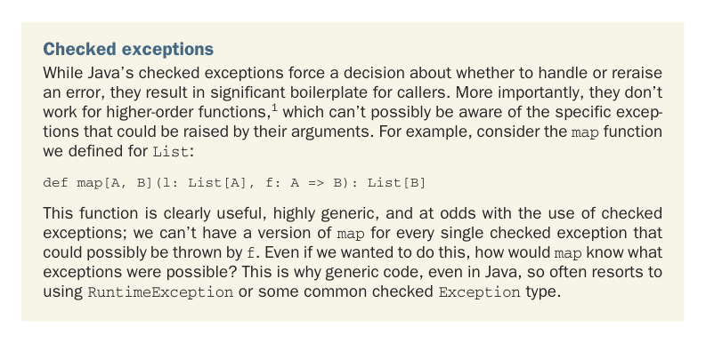

# Страница 0098

[<- Страница 0097](./page-0097) | [Индекс страниц](./) | [Страница 0099 ->](./page-0099)

> Часть 1: Введение в функциональное программирование / Глава 4: Обработка ошибок без исключений / 4.1 Хорошие и плохие стороны исключений

## 69 4.1 Хорошие и плохие стороны исключений

Ещё один способ въебать в голову понимание RT — осознать, что смысл RT-выражений не зависит от контекста, его можно ковырять локально, как чистый атом в вакууме, а вот non-RT выражения — это контекстно-зависимая хрень, требующая глобального мозгоёбства по всему стеку. Взять RT-выражение `42` `+` `5` — его значение вечно и неизменно равно `47`, независимо от того, в какую большую хрень оно впихнуто. А вот `throw` `Exception("fail")` — чистый контекстный пиздец, как мы только что продемонстрировали: значение пляшет в зависимости от того, в каком `try` блоке (если вообще в каком-то) оно сидит. У исключений две главные проблемы, пацаны:

- *Исключения ломают RT и впихивают контекстную зависимость*. Это отрывает нас от простой подстановочной модели, как от райского сада, и позволяет плодить запутанный код на исключениях — сплошной трип с неожиданными поворотами. Отсюда та народная мудрость из фольклора: исключения только для ошибок, а не для управления потоком, чтоб не ебаться с непредсказуемостью.

- *Исключения не типобезопасны*. Тип `failingFn`, `Int` `=>` `Int` ни хуя не намекает, что исключения могут вылететь, как дьявол из табакерки, и компилятор ни за что не заставит коллеров `failingFn` решать, как с этим говном разбираться. Если забудешь проверить исключение в `failingFn` — привет, runtime-ебанина.1



Проверяемые исключения. Пока в Java проверяемые исключения заставляют решать — обработать ошибку или перекинуть дальше, они плодят тонну бойлерплейтного дерьма для всех, кто зовёт. Ещё хуже — они на хуй не работают с higher-order функциями,1 которые и понятия не имеют, какие конкретно исключения кинут их аргументы. Возьмём, к примеру, функцию `map`, которую мы определяли для `List`:

```scala
def map[A, B](l: List[A], f: A => B): List[B]
```

Эта функция — чистый кайф, универсальная до одури, и она в разнос с проверяемыми исключениями; мы же не станем плодить версию `map` под каждое возможное исключение от `f`. Даже если б захотели, откуда `map` знать, какие исключения в принципе возможны? Вот почему даже в Java generic-код так часто скатывается в `RuntimeException` или какой-нибудь общий проверяемый тип `Exception` — классика жанра, мем с 2004-го.

Нам подавай альтернативу исключениям без этих подстав, но без потери главного плюса: исключения позволяют собрать обработку ошибок в одном месте, централизованно, а не размазывать эту херню по всему кодбейсу, как говно по дереву. Наша техника — на старой как мир идее: вместо того чтобы швырять исключение, возвращаем значение, которое орёт "тут exceptional condition случился!". Знакомо всем, кто ковырял return codes в C для обработки ошибок, но вместо сырых кодов ошибок мы вводим новый generic-тип для этих *возможно определённых*

1 Это активная область исследований, и Scala 3 уже имеет экспериментальные фичи, чтоб это подлатать. См.

https://mng.bz/yaao за деталями.

[<- Страница 0097](./page-0097) | [Индекс страниц](./) | [Страница 0099 ->](./page-0099)
