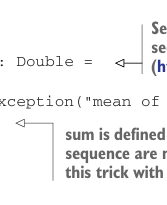

# Страница 0099
[<- Страница 0098](./page-0098) | [Индекс страниц](./) | [Страница 0100 ->](./page-0100)

> Часть 1: Введение в функциональное программирование / Глава 4: Обработка ошибок без исключений / 4.2 Возможные альтернативы исключениям

*значений* и юзаем функции высшего порядка, чтоб запаковать типичные паттерны обработки и распространения этих уебков-ошибок. В отличие от C-шных кодов ошибок, где всё на честном слове, наша схема обработки полностью типобезопасная — компилятор как строгий сержант заставит тебя разобраться со всеми случаями, и синтаксического бардака минимум. Ща разберём, как эта хуйня работает на деле.

### 4.2 Возможные альтернативы исключениям

Давай теперь возьмём реальный кейс из жизни, где обычно *exception* (исключение) кидают, и посмотрим, как можно обойтись без этой хуйни. Вот имплементация функции, которая считает среднее арифметическое от списка — а если список пустой, то вообще пиздец, *undefined* (неопределённое значение):



> *Seq* — это общий интерфейс для всяких линейных коллекций типа последовательностей. Залезь в API-доки (http://mng.bz/f4k9), если хочешь копнуть глубже.

```scala
def mean(xs: Seq[Double]): Double =
  if xs.isEmpty then
    throw new ArithmeticException("mean of empty list!")
  else
    xs.sum / xs.length
```

> *sum* болтается как метод на *Seq* только если элементы числовые. Стандартная либа фигачит этот трюк через *implicits* (неявные параметры), но мы пока не будем в эту трясину лезть.

Функция `mean` — классический пример *partial function* (частично определённой функции), то есть она не для всех входов определена, как тот чувак на тусовке, который не со всеми спит. Обычно *partial function* такая, потому что делает предположения про инпуты, которых типы не гарантируют.<sup>2</sup> Ты, небось, привык в таких случаях *exception*-ом швыряться, но у нас есть варианты поумнее. Давай на примере `mean` разберём. Первый вариант — вернуть какую-нибудь хуёвую подделку типа `Double`. Можем всегда `xs.sum / xs.length` лепить, и для пустого инпута выйдет `0.0/0.0`, что равно `Double.NaN`, или любой другой *sentinel value* (sentinel-значение). В других случаях можно `null` вместо нормального значения запихнуть. Эта общая категория подходов — классика обработки ошибок в языках без *exceptions* (исключений), и мы её нахуй отвергаем по нескольким причинам:

- *Позволяет ошибкам тихо расползаться, как тараканам в подвале.* Каллер забудет проверить условие, компилятор не пикнет, и дальше код пойдёт в разнос. Часто баг вылезет только через сто строк, когда уже поздно.

- *Генерит уйму boilerplate-кода (boilerplate) на сайтах вызовов с явными `if`-проверками, реальный ли результат прилетел.* А если несколько таких функций подряд — boilerplate умножается нахуй, и ошибки ещё аггрегировать надо как-то.

<sup>2</sup> Функция может быть *partial* и если на некоторых входах не завершается (бесконечный цикл, блядь). Но это не *recoverable error* (восстанавливаемая ошибка), так что спорить не о чем. Копай *chapter notes* (примечания к главе) (https://github.com/fpinscala/fpinscala/wiki) за деталями про *partiality* (частичность).

[<- Страница 0098](./page-0098) | [Индекс страниц](./) | [Страница 0100 ->](./page-0100)
