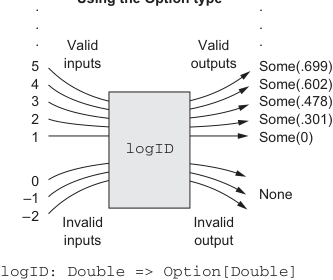

# Страница 0101
[<- Страница 0100](./page-0100) | [Индекс страниц](./) | [Страница 0102 ->](./page-0102)

> Часть 1: Введение в функциональное программирование / Глава 4: Обработка ошибок без исключений / 4.3 Тип данных Option / 4.3.1 Паттерны использования Option

Теперь тип возвращаемого значения честно отражает, что результат может быть не всегда определён — типа, "пацаны, бывает и пусто". Мы по-прежнему всегда возвращаем результат объявленного типа (теперь `Option[Double]`) из нашей функции, так что `mean` теперь *тотальная функция*, блядь, которая на любой входной аргумент выдаст ровно один выходной — без этих импровизированных None из ниоткуда. Рисунок 4.1 показывает разницу между sentinel-хуйней (sentinel value) и нормальным `Option`.

**Реакция на некорректные входы**

**С sentinel-значением**  
**С типом Option**


...



...

...

...

**Корректные входы** **Корректные выходы**

5 4 3 2 1

5 4 3 2 1

.699 .602 .478 .301 0

Some(.699) Some(.602) Some(.478) Some(.301) Some(0)

```scala
logID
logID
```

0 –1 –2

0 –1 –2

–9999999.99

None

**Некорректные входы** **Sentinel-значение**

**Некорректные входы** **Некорректный выход**

```scala
logID: Double => Double
logID: Double => Option[Double]
```

> Все некорректные входы маппим в специальное значение того же типа, что и корректные выходы. Выбор этого специального значения — сплошная лотерея, и компилятор не проконтролирует, правильно ли коллер с ним справится.

> Каждый корректный выход оборачиваем в Some. Некорректные входы летят в None. Компилятор заставляет коллера явно разбираться с возможностью провала — никаких "ой, забыл".

**Рисунок 4.1** Техники, чтобы сделать функцию тотальной, не теряя реакции на некорректные входы

### 4.3.1 Паттерны использования Option

Частичная хуйня повсюду в программировании, и `Option` (а также тип данных `Either`, о котором скоро базарим) — это типичный способ с этим разобраться в FP. Ты увидишь `Option` по всему стандартному либу Скалы, например, в таких случаях:

- Поиск по ключу в `Map` (http://mng.bz/g1qv) возвращает `Option`.

- `headOption` и `lastOption` для листов и других итерируемых (http://mng.bz/ePqV) выдают `Option` с первым или последним элементом, если последовательность не пустая.

Это не полный список, `Option` вылезет в куче мест. Что делает `Option` удобным — это вынос общих паттернов обработки ошибок в функции высшего порядка (higher-order functions), избавляя от boilerplate-кода с исключениями (exceptions), который все ненавидят. В этой секции разберём базовые функции для работы с `Option`. Цель не в том, чтобы наизусть выучить все, а чтобы хватило фана, чтоб вернуться сюда и сам допилить функционал для ошибок, когда припрут.

[<- Страница 0100](./page-0100) | [Индекс страниц](./) | [Страница 0102 ->](./page-0102)
