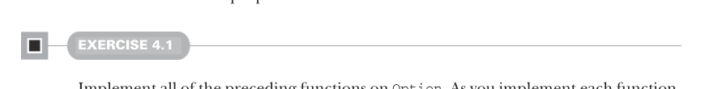

# Страница 0102

[<- Страница 0101](./page-0101) | [Индекс страниц](./) | [Страница 0103 ->](./page-0103)

> Часть 1: Введение в функциональное программирование / Глава 4: Обработка ошибок без исключений / 4.3 Тип данных Option / 4.3.1 Паттерны использования Option

## 73 4.3 Тип данных Option

БАЗОВЫЕ ФУНКЦИИ НА `Option` — это как `List`, который максимум один элемент вмещает, и куча функций с `List`, что мы раньше ковыряли, имеют аналоги на `Option`. 
Давай глянем на эти функции. Как с функциями на `Tree` в третьей главе делали — засунули их внутрь тела типа `Option`, чтоб dot-нотацией `obj.fn(arg)` вызывать. 
Это рождает одну доп. заёбку с вариацией, о которой ща поговорим. Пошли смотреть.

**Листинг 4.2 Тип данных `Option`**


> Применить `f`, которая может наебнуться, к `Option`, если не `None` (пустой вариант).

```scala
enum Option[+A]:
case Some(get: A)
case None
```

> Применить `f`, если `Option` не `None`.

> `B >: A` значит, что параметр типа `B` — супертип (supertype) `A`.

```scala
def map[B](f: A => B): Option[B]
def flatMap[B](f: A => Option[B]): Option[B]
def getOrElse[B >: A](default: => B): B
def orElse[B >: A](ob: => Option[B]): Option[B]
def filter(f: A => Boolean): Option[A]
```

> Не вычислять `ob`, пока не припёрло.

> `Some` в `None` превращать, если значение `f` не удовлетворяет.

Тут новый синтаксис вылез. Аннотация типа `default: => B` в `getOrElse` (и похожая в `orElse`) говорит, что аргумент типа `B`, но лениво вычисляется, только когда функция припрется. 
Не парьтесь пока, в следующей главе про *ненестрогость* (non-strictness) наваляем по полной. 
Ещё параметр типа `B >: A` на `getOrElse` и `orElse` значит, что `B` — равен или *супертип* (supertype) `A`. 
Нужно, чтоб Scala поверил, что `Option[+A]` ковариантен по `A`. 
Подробности в нотах главы ([https://github.com/fpinscala/fpinscala/wiki](https://github.com/fpinscala/fpinscala/wiki)). 
Заёбано, бля, но в Scala без этого никуда; к счастью, глубоко в субтайпинге и вариации ковыряться не обязательно для наших дел.



#### УПРАЖНЕНИЕ 4.1

Реализуй все эти функции на `Option`. Пока пишешь каждую, подумай, чё она значит и когда её пихать в код. 
Дальше разберём, когда какую юзать. Вот подсказки для этой хуйни:

- Матчинг по образцам (pattern matching) — ок, но кроме `map` и `getOrElse` можно без него обойтись. 
  Попробуй `flatMap`, `orElse` и `filter` через `map` и `getOrElse`.

- Для `map` и `flatMap` тип-сигнатура сама подскажет, как писать.

- `getOrElse` берёт результат из кейса `Some` в `Option`, а если `Option` — это `None`, то возвращает дефолтку.

[<- Страница 0101](./page-0101) | [Индекс страниц](./) | [Страница 0103 ->](./page-0103)
