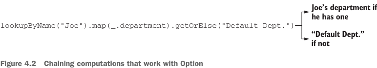

# Страница 0104

[<- Страница 0103](./page-0103) | [Индекс страниц](./) | [Страница 0105 ->](./page-0105)

> Часть 1: Введение в функциональное программирование / Глава 4: Обработка ошибок без исключений / 4.3 Тип данных Option / 4.3.1 Паттерны использования Option

## 75 4.3 Тип данных Option


> Отдел Джо, если Джо — сотрудник

```scala
lookupByName("Joe").map(_.department)
```

> None, если Джо не сотрудник

> Some(manager), если у Джо есть менеджер

```scala
lookupByName("Joe").flatMap(_.manager)
```

> None, если Джо не сотрудник или у него нет менеджера



> Отдел Джо, если он есть

```scala
lookupByName("Joe").map(_.department).getOrElse("Default Dept.")
```

> «Default Dept.», если нет

Рисунок 4.2. Цепочка вычислений, которые работают с Option

Как показывает реализация `variance`, с `flatMap` мы можем слепить вычисление из кучи этапов — типа домино, где любой может наебнуться, — и вся хуйня прервётся на первой же ошибке: `None.flatMap(f)` сразу сплюнет `None`, не заморачиваясь на `f`. `filter` юзаем, чтоб перевернуть успех в провал, если значение не прошло по предикату — классика, как фильтр на входе в клуб. Обычный паттерн: крутим `Option` через `map`, `flatMap` и/или `filter`, а в конце `getOrElse` для обработки ошибок — чисто как пайплайн в Unix, только без сегфолтов:

```scala
val dept: String =
lookupByName("Joe").
map(_.department).
filter(_ != "Accounting").
getOrElse("Default Dept")
```

`getOrElse` здесь переводит `Option[String]` в `String`, подставляя дефолтный отдел, если ключа `"Joe"` нет в `Map` или отдел Джо — `"Accounting"`. `orElse` похож на `getOrElse`, но возвращает другой `Option`, если первый пустой — идеально для цепочек, где пробуем план Б, если план А обосрался. Классическая идиома — `o.getOrElse(throw` `Exception("FAIL"))`, чтоб из `None`-кейса `Option` вернуться к эксепшену. Общее правило: эксепшены только если ни один адекватный код их ловить не будет — типа «всё, пиздец, приложение в могилу»; если для кого-то это recoverable error, как в продакшене после деплоя, — юзай `Option` (или `Either`, как позже разберём), чтоб дать флекс. Когда в сомнениях — не трогай эксепшены, особенно на старте: то, что кажется годным кейсом для них, часто лучше ложится на значения, просто мозг ещё в imperative-болоте сидит, как я в нулевых с Java NullPointer'ами воевал.

[<- Страница 0103](./page-0103) | [Индекс страниц](./) | [Страница 0105 ->](./page-0105)
