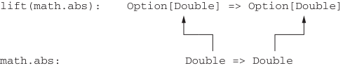

# Страница 0105

[<- Страница 0104](./page-0104) | [Индекс страниц](./) | [Страница 0106 ->](./page-0106)

> Часть 1: Введение в функциональное программирование / Глава 4: Обработка ошибок без эксепшенов / 4.3 Тип данных Option / 4.3.2 Композиция Option, lifting и обёртка API на эксепшенах

Как видите, возвращать ошибки как обычные значения — это пиздец как удобно, а высшие функции позволяют собрать всю обработку ошибок в один жирный блок, как будто эксепшены кидаем, только без этой imperative хуйни. Заметьте, не нужно на каждом шаге выебываться с чеком `None` — наваливаем пачку трансформаций, а потом, когда в настроении, чекнем `None` и разберёмся. Плюс, компилятор как строгий код-ревьюер: `Option[A]` — это совсем другой тип, чем `A`, и он не даст вам забыть явно отдеферить или обработать этот ебучий шанс на `None`. Безопасность на уровне "не просрёшь".

### 4.3.2 Композиция Option, lifting и обёртка API на эксепшенах

Легко запаниковать и подумать: "Бля, как только `Option` в коде заведётся, она как вирус по всей базе разлетится". Представьте, все коллеры методов, что жрут или сплевывают `Option`, перелопатить придётся под `Some` или `None`. Но хуй там — мы *лифтим* (lifting) обычные функции, чтоб они на `Option` работали. Взять `map`: она позволяет ковырять значения типа `Option[A]` функцией типа `A` `=>` `B`, которая возвращает `Option[B]`. Или по-другому: `map` превращает вашу старую функцию `f` типа `A` `=>` `B` в монстра типа `Option[A]` `=>` `Option[B]`. Давайте разложим по полочкам:


> Напомню, _.map(f) — это то же самое, что анонимка oa => oa.map(f).

```scala
def lift[A, B](f: A => B): Option[A] => Option[B] =
  _.map(f)
```

Это значит, любую функцию, что валяется без дела, можно через `lift` поднять в контекст одного `Option`. Примерчик:

```scala
val absO: Option[Double] => Option[Double] =
  lift(math.abs)
scala> val ex1 = absO(Some(-1.0))
val ex1: Option[Double] = Some(1.0)
```

Рисунок 4.3 разбирает этот пример по косточкам.

**Подъём (lifting) функций**

```scala
lift(math.abs):
  Option[Double] => Option[Double]
```



```scala
Double => Double
math.abs:
```

> lift(f) возвращает функцию, которая None мапит в None, а к Some применяет f. Сама f даже не в курсе про Option.

Рисунок 4.3. Подъём (lifting) функции для работы с Option

Объект `math` тащит кучу математических функций на борту — `abs`, `sqrt`, `exp` и прочая херня. Нам не пришлось переписывать `math.abs` под

[<- Страница 0104](./page-0104) | [Индекс страниц](./) | [Страница 0106 ->](./page-0106)
