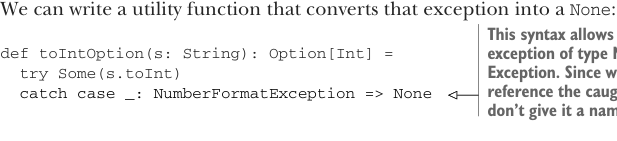
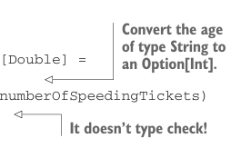

# Страница 0106
[<- Страница 0105](./page-0105) | [Индекс страниц](./) | [Страница 0107 ->](./page-0107)

> Часть 1: Введение в функциональное программирование / Глава 4: Обработка ошибок без исключений / 4.3 Тип данных Option / 4.3.2 Композиция Option, подъём и обёртка API, ориентированных на исключения

## 77 4.3 Тип данных Option

опциональных значений; мы просто после всего этого дерьма подтянули его в контекст ``Option`` постфактум. 

Этот трюк прокатывает с любой функцией, блядь. Давай глянем другой примерок, чтоб дошло. 

Представь, пилю логику для сайта автостраховки — там форма, юзеры стучат по кнопке "дай котировку онлайн мгновенно". Хотим распарсить эту хуйню из формы и в итоге дёрнуть нашу `insuranceRateQuote`:

```scala
/**
 * Top secret formula for computing an annual car
 * insurance premium from two key factors.
*/
def insuranceRateQuote(age: Int, numberOfSpeedingTickets: Int): Double
```

Мы хотим вызвать эту функцию, но юзер шлёт возраст и количество лихачеств в веб-форме — прилетает голимая строковая поебень, которую надо попробовать в инты перекинуть. Парсинг может наебнуться к херам; дана строка ``s``, пытаемся запарсить в ``Int`` через ``s.toInt``, а она кидает ``NumberFormatException`` (NumberFormatException), если строка не интовая хуйня:

```scala
scala> "112".toInt
res0: Int = 112
scala> "hello".toInt
java.lang.NumberFormatException: For input string: "hello"
at java.lang.NumberFormatException.forInputString(...)
...
```

Можем слепить утилитку, которая это исключение в ``None`` конвертит — как презерватив на exception-based API наденем:



> Этот синтаксис ловит любое исключение типа NumberFormatException. Нам пох на пойманное исключение, так что имени не лепим, а пихаем _ — классика, пацаны, я через это 16 лет ковырялся.

```scala
def toIntOption(s: String): Option[Int] =
  try Some(s.toInt)
  catch case _: NumberFormatException => None
```

Давай используем ``toIntOption``, чтоб слепить ``parseInsuranceRateQuote`` — она жрёт возраст и штрафы как строки, парсит их, и если оба инта — дёргает ``insuranceRateQuote``. Иначе — ``None``, без драм.

**Листинг 4.3. Использование `Option`**



```scala
def parseInsuranceRateQuote(
  age: String,
  numberOfSpeedingTickets: String
): Option[Double] =
  val optAge: Option[Int] = toIntOption(age)
  val optTickets: Option[Int] = toIntOption(numberOfSpeedingTickets)
  insuranceRateQuote(optAge, optTickets)
```

> Конвертируй возраст типа `String` в `Option[Int]`.

> А типы не сходятся, сука! Не компилится!

[<- Страница 0105](./page-0105) | [Индекс страниц](./) | [Страница 0107 ->](./page-0107)
