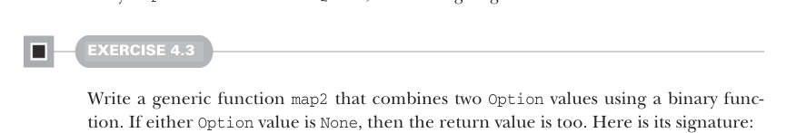

# Страница 0107
[<- Страница 0106](./page-0106) | [Индекс страниц](./) | [Страница 0108 ->](./page-0108)

> Часть 1: Введение в функциональное программирование / Глава 4: Обработка ошибок без исключений / 4.3 Тип данных Option / 4.3.2 Композиция Option, lifting и обёртка API на исключениях

Но вот засада — мы распарсили `optAge` и `optTickets` в `Option[Int]`, а как теперь вызвать `insuranceRateQuote`, которая жрёт два голых `Int`? Переписывать её под `Option[Int]`? Ни хуя в голову, это спутает ответственности в один тюк, заставит её париться, что предыдущий шаг мог наебнуться, не говоря уже о том, что мы можем и не иметь прав её ковырять — она где-то в другом модуле валяется, как старая библиотека от экс-тимлида. Нет, нам надо поднять (`lift`) `insuranceRateQuote` в контекст двух опционалов, чтоб она там плясала. Можно, конечно, в `parseInsuranceRateQuote` по паттерн-матчингу попиздеть явно, но это будет как ковырять в зубах зубочисткой — уныло и долго.



#### УПРАЖНЕНИЕ 4.3

Напиши обобщённую (generic) функцию `map2`, которая комбинирует два значения `Option` с помощью бинарной функции. Если хоть один `Option` — `None`, то и результат тоже `None`. Вот её сигнатура:

```scala
def map2[A, B, C](a: Option[A], b: Option[B])(f: (A, B) => C): Option[C]
```

Заметили, два параметр-листа: первый жрёт `Option[A]` и `Option[B]`, второй — функцию `(A, B) => C`. Вызывать так: `map2(oa, ob)(_ + _)`. Могли бы одним листом обойтись, но в Scala это классика — когда функция берёт кучу параметров, а последний — функция сама по себе.<sup>3</sup> Это даёт сахар для многострочных анонимок: вместо параметр-листа можно indented-блок или фигурные скобки:


```scala
map2(oa, ob): (a, b) =>
a + b
```

> Блок с отступом (indented block) после двоеточия и параметр-листа

```scala
map2(oa, ob) { (a, b) =>
a + b
}
```

> Блок в фигурных скобках

В книге будем indented-блоки юзать, но экспериментируйте с обоими — как хотите, лишь бы код читался.

<sup>3</sup> Ещё один плюс от нескольких параметр-листов в Scala 2: вывод типов (type inference) получше работал. Scala 2 выводила типы по листам по очереди. Если в первом листе тип зафиксировался, то в следующих он уже не дёргался (не обобщался дальше). Например, `map(List(1, 2, 3), _ + 1)` из главы 3 не компилилось бы с ошибкой вывода типов (inference error), но с двумя листами — `map(List(1, 2, 3))(_ + 1)` — всё ок. В Scala 3 типы выводит сразу по всем листам разом, так что плюсов от этого трюка больше нет.

[<- Страница 0106](./page-0106) | [Индекс страниц](./) | [Страница 0108 ->](./page-0108)
