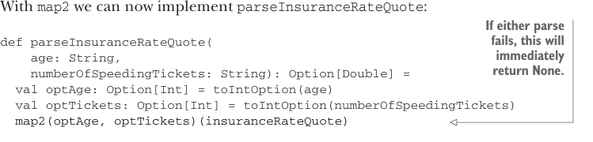

# Страница 0108

[<- Страница 0107](./page-0107) | [Указатель страниц](./) | [Страница 0109 ->](./page-0109)

> Часть 1: Введение в функциональное программирование / Глава 4: Обработка ошибок без исключений / 4.3 Тип данных Option / 4.3.2 Композиция Option, подъём и обёртка API-шек с исключениями

## 79 4.3 Тип данных Option

С `map2` мы теперь можем заебенить `parseInsuranceRateQuote` одним махом, без лишнего говна:



> Если любой из парсов наебнётся, сразу None, без церемоний и танцев с бубном.

```scala
def parseInsuranceRateQuote(
age: String,
numberOfSpeedingTickets: String): Option[Double] =
val optAge: Option[Int] = toIntOption(age)
val optTickets: Option[Int] = toIntOption(numberOfSpeedingTickets)
map2(optAge, optTickets)(insuranceRateQuote)
```

`map2` — это как турбонаддув для старого кода: не надо лезть в каждую функцию с двумя аргументами и перекраивать её под `Option`. Поднимаем их в контекст `Option` постфактум, когда припрут. Уже просекаешь, как слепить `map3`, `map4` и `map5`? Типа, рекурсия или fold, пацаны, само собой. Давай глянем другие похожие приколы, где FP спасает жопу.


#### УПРАЖНЕНИЕ 4.4

Напиши функцию `sequence`, которая склеит список `Option`-ов в один `Option` со списком всех `Some` из оригинала. Если хоть один `None` влезет — весь результат в None, как мина в поле; иначе `Some` с полным набором значений. Сигнатура вот такая:⁴

```scala
def sequence[A](as: List[Option[A]]): Option[List[A]]
```

Бывает, надо маппить по списку функцией, которая может обосраться и выдать `None` на любом элементе — классика, как парсинг строки в инт. Что делать? Берёшь map, а потом sequence — и вуаля, `Option[List[Int]]` готов. Я сам так в проде спасался, когда legacy-строки летели толпой.

```scala
def parseInts(as: List[String]): Option[List[Int]] =
sequence(as.map(a => toIntOption(s)))
```

Но вот засада: неэффективно, блядь, два прохода по списку — сначала каждый `String` в `Option[Int]`, потом комбайним в `Option[List[Int]]`. Типа, как ездить на велике туда-обратно вместо одного рывка. Такое дерьмо всплывает сплошь и рядом, так что лепим универсальную `traverse` с такой сигнатурой:

```scala
def traverse[A, B](as: List[A])(f: A => Option[B]): Option[List[B]]
```

⁴ Это когда OO-стиль вообще не в кассу, пацаны. Не метод на `List` (ей пох на `Option`), не на `Option` (ей пох на `List`), так что в companion object (companion object) `Option` и точка. Я через такое код-ревью прошёл — слёзы и мат.

[<- Страница 0107](./page-0107) | [Указатель страниц](./) | [Страница 0109 ->](./page-0109)
