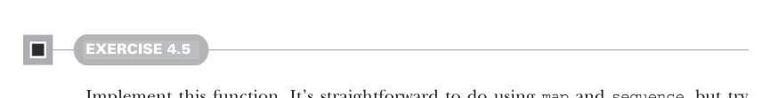
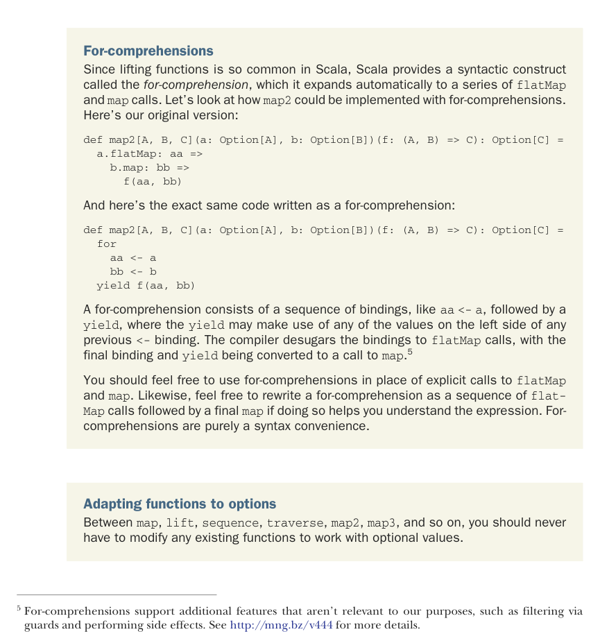

# Страница 0109
[<- Страница 0108](./page-0108) | [Индекс страниц](./) | [Страница 0110 ->](./page-0110)

> Часть 1: Введение в функциональное программирование / Глава 4: Обработка ошибок без исключений / 4.3 Тип данных Option / 4.3.2 Композиция Option, lifting и обёртка API на исключениях



#### УПРАЖНЕНИЕ 4.5

Реализуй эту хуйню. Легко как два пальца обоссать с `map` и `sequence`, но попробуй эффективнее — чтоб список один раз прошёлся, без этой императивной хуйни. Короче, реализуй `sequence` через `traverse`, как нормальный FP-шник.



**For-выражения (for-comprehensions)**  
Поскольку lifting функций в Scala — это как воздух для нас, Scala кидает синтаксический сахар под названием *for-выражения (for-comprehensions)*, который компилятор сам разжёвывает в цепочку `flatMap` и `map` вызовов. Давай глянем, как `map2` можно закодить через for-выражения. Вот наша оригинальная версия:

```scala
def map2[A, B, C](a: Option[A], b: Option[B])(f: (A, B) => C): Option[C] =
a.flatMap: aa =>
b.map: bb =>
f(aa, bb)
```

А вот тот же самый код, но в for-выражении — чистый кайф:

```scala
def map2[A, B, C](a: Option[A], b: Option[B])(f: (A, B) => C): Option[C] =
for
aa <- a
bb <- b
yield f(aa, bb)
```

For-выражение (for-comprehension) — это последовательность биндингов типа `a <- a`, за которыми следует `yield`, где `yield` может юзать все значения слева от предыдущих `<-`. Компилятор десахарит это в `flatMap` вызовы, а финальный биндинг с `yield` превращает в `map`.[^5]

Юзай for-выражения вместо явных `flatMap` и `map` — не парься. И наоборот, если хочешь разобраться, разворачивай for-выражение в цепь `flatMap` с финальным `map`. Это чисто сахар для удобства, без магии.

**Адаптация функций под Option**  
Между `map`, `lift`, `sequence`, `traverse`, `map2`, `map3` и прочей хуйнёй тебе вообще не придётся переписывать старые функции под опционалы — всё само собой.

[^5]: For-выражения ещё поддерживают фильтры через guards (охранные условия) и сайд-эффекты, но нам это нахуй не сдалось. Глянь http://mng.bz/v444 за деталями.

[<- Страница 0108](./page-0108) | [Индекс страниц](./) | [Страница 0110 ->](./page-0110)
