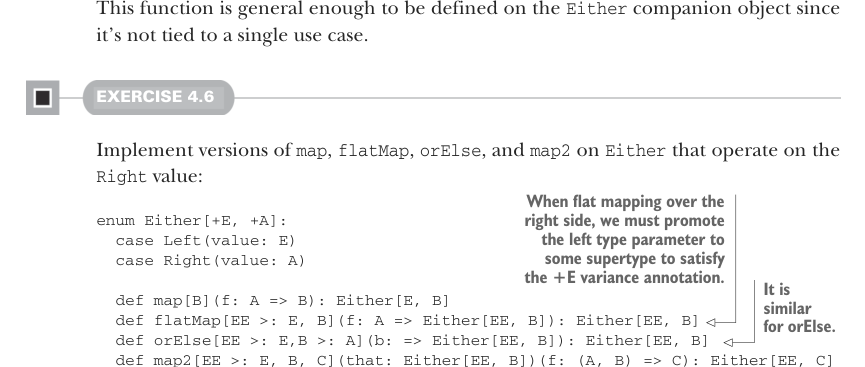

# Страница 0111
[<- Страница 0110](./page-0110) | [Индекс страниц](./) | [Страница 0112 ->](./page-0112)

> Часть 1: Введение в функциональное программирование / Глава 4: Обработка ошибок без исключений / 4.4 Тип данных Either

Короче, пацаны, давайте выдернем из этой хуйни более универсальную функцию ``catchNonFatal``, которая просто факторит этот классический паттерн — когда исключения, брошенные в стену, ловим и превращаем в нормальные значения, чтоб не бегать за ними с сачком:

```scala
def catchNonFatal[A](a: => A): Either[Throwable, A] =
try Right(a)
catch case NonFatal(t) => Left(t)
```



Эта функция — как швейцарский нож, настолько общая, что её можно запилить прямо в companion object к ``Either``, без привязки к какому-то одному узкому кейсу, который завтра забудется.

#### УПРАЖНЕНИЕ 4.6

Напилите версии ``map``, ``flatMap``, ``orElse`` и ``map2`` для ``Either``, чтоб они ковырялись именно в значении ``Right``:

> При flatMap'е над правой стороной приходится левый тип-параметр поднять до супертипа, чтоб угодить аннотации ковариантности +E. То же дерьмо с orElse.

```scala
enum Either[+E, +A]:
case Left(value: E)
case Right(value: A)
def map[B](f: A => B): Either[E, B]
def flatMap[EE >: E, B](f: A => Either[EE, B]): Either[EE, B]
def orElse[EE >: E,B >: A](b: => Either[EE, B]): Either[EE, B]
def map2[EE >: E, B, C](that: Either[EE, B])(f: (A, B) => C): Either[EE, C]
```

Заметим, что с этими дефами ``Either`` теперь пляшет в for-comprehension'ах как родной (вспомните, это ж сахар над ``flatMap``, ``map`` и всей этой тусовкой). Вот, к примеру:

```scala
def parseInsuranceRateQuote(
age: String,
numberOfSpeedingTickets: String): Either[Throwable,Double] =
for
a <- Either.catchNonFatal(age.toInt)
tickets <- Either.catchNonFatal(numberOfSpeedingTickes.toInt)
yield insuranceRateQuote(a, tickets)
```


Теперь вместо голого ``None`` при фейле мы видим реальное исключение, которое прилетело, — пиздец, как это меняет дело, наконец-то есть конкретика, а не "ой, что-то сломалось".

#### УПРАЖНЕНИЕ 4.7

Напилите ``sequence`` и ``traverse`` для ``Either``. Они должны хватать первую встреченную ошибку, если такая объявится:

[<- Страница 0110](./page-0110) | [Индекс страниц](./) | [Страница 0112 ->](./page-0112)
