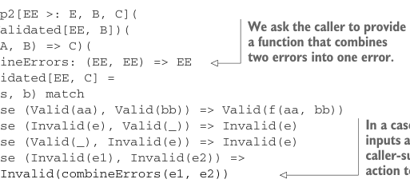

# Страница 0116
[<- Страница 0115](./page-0115) | [Индекс страниц](./) | [Страница 0117 ->](./page-0117)

> Часть 1: Введение в функциональное программирование / Глава 4: Обработка ошибок без исключений / 4.4 Тип данных Either / 4.4.2 Извлечение типа Validated

## 87 4.4 Тип данных Either

Давай ещё одну обобщёнку закрутим: наш тип `Validated` накапливает `List[E]` ошибок, как коллекционер бабочек букашек. А нахуя именно `List`? Вдруг захотим другой тип впихнуть, типа `Vector`? Или коллекцию, которая требует хотя бы один элемент, потому что пустая `Invalid(Nil)` — это как пивасик без пены, полный пиздец? Или тип с какой-то доп. структурой, типа хитрой `Tree`? Короче, если ковыряться в определении `Validated`, то только одно место упирается в то, что ошибки — это список: в `map2`, где мы конкатим ошибки из двух `Invalid`, как два лог-файла в один merge. Давай переопределим `Validated`, чтоб не висеть напрямую на `List` для накопления ошибок — чисто, как в продакшене, где dependency hell поджидает за углом:


```scala
enum Validated[+E, +A]:
case Valid(get: A)
case Invalid(error: E)
```

> Теперь случай ошибки — это одиночный E вместо List[E].

На первый взгляд, хуйня какая-то, шаг назад: определяем `Validated` почти как `Either`, классика "refactor to hell". Но фишка этой версии `Validated` против `Either` — в сигнатуре `map2`. Нам надо слить два invalid в один, чтоб не плодить сущностей. В старой версии `Validated`, где `Invalid` обнимал `List[E]`, мы просто конкатали списки, как git merge без конфликтов. А тут — два `E` в один `E`, и про `E` мы нихуя не знаем, полный black box. Кажется, засада, как в том меме с котом, который пытается выбраться из коробки, но можно сигнатуру `map2` подкрутить и просто потребовать функцию-сливатель:

```scala
enum Validated[+E, +A]:
case Valid(get: A)
case Invalid(error: E)
```



```scala
def map2[EE >: E, B, C](
b: Validated[EE, B])(
f: (A, B) => C)(
combineErrors: (EE, EE) => EE
): Validated[EE, C] =
(this, b) match
case (Valid(aa), Valid(bb)) => Valid(f(aa, bb))
case (Invalid(e), Valid(_)) => Invalid(e)
case (Valid(_), Invalid(e)) => Invalid(e)
case (Invalid(e1), Invalid(e2)) =>
```

> Мы просим вызывающего подкинуть функцию, которая сольёт две ошибки в одну.

> Если оба входа invalid, юзаем эту функцию от вызывающего, чтоб слить ошибки воедино.

```scala
Invalid(combineErrors(e1, e2))
```

С этой версией `Validated` создание `Person` вернёт `Validated[List` `[String],` `Person]`, и раз юзаем `List[String]` для ошибок, то при вызове `map2` придётся запихнуть конкат списка в `combineErrors`. Например, если `Name` и `Age` тоже перелопатили под `Validated` с `List[String]` для ошибок, то `Person` можно слепить через `Name(name).map2` `(Age(age))(Person(_,` `_))(_` `++` `_)`. Потому что `traverse` зовёт `map2`, а тот требует `combineErrors`, но `traverse` про тип ошибки — ноль инфы. Значит, сигнатуру придётся менять

[<- Страница 0115](./page-0115) | [Индекс страниц](./) | [Страница 0117 ->](./page-0117)
