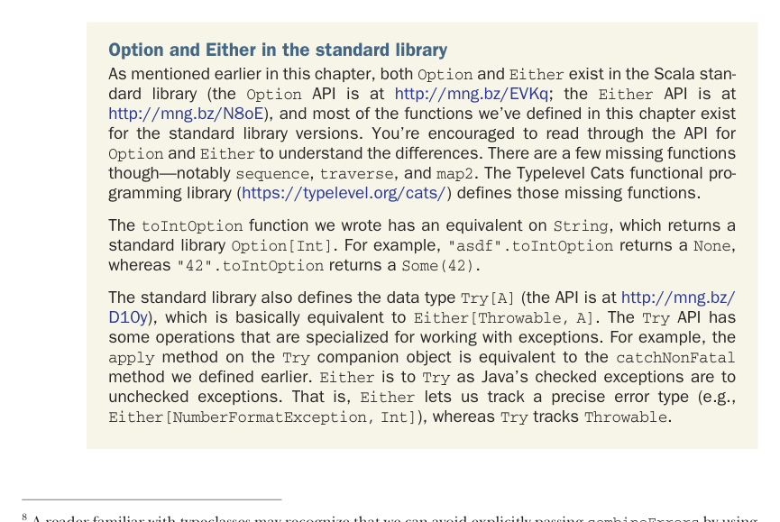

# Страница 0117

[<- Страница 0116](./page-0116) | [Индекс страниц](./) | [Страница 0118 ->](./page-0118)

> Часть 1: Введение в функциональное программирование / Глава 4: Обработка ошибок без исключений / 4.4 Тип данных Either / 4.4.2 Извлечение типа Validated

Чтобы ``traverse`` тоже жрал ``combineErrors`` в качестве параметра. И по той же аналогии, ``sequence`` требует параметра ``combineErrors``:

```scala
def traverse[E, A, B](
  as: List[A],
  f: A => Validated[E, B],
  combineErrors: (E, E) => E
): Validated[E, List[B]] =
  as.foldRight(Valid(Nil): Validated[E, List[B]])((a, acc) =>
    f(a).map2(acc)(_ :: _)(combineErrors)
  )

def sequence[E, A](
  vs: List[Validated[E, A]],
  combineErrors: (E, E) => E
): Validated[E, List[A]] =
  traverse(vs, identity, combineErrors)
```

Таскать эту ``combineErrors``-функцию по всем углам — полная хуйня, неудобно, как чемодан без колёс по лестнице в метро в час пик. В третьей части разберёмся, как с таким шаблонным дерьмом бороться.^8 Пока ключевая идея такая: ``Validated[E, A]`` обратимо конвертируется туда-сюда с ``Either[E, A]``, разница только в поведении ``map2``.^9 Пацаны, это как два брата-близнеца, один строже в воспитании, другой помягче — сам через это прошёл, знаю подвох.



## Option и Either в стандартной библиотеке

Как уже говорил раньше в этой главе, и ``Option``, и ``Either`` сидят в стандартной библиотеке Scala (stdlib) (API для ``Option`` — [http://mng.bz/EVKq;](http://mng.bz/EVKq;), для ``Either`` — [http://mng.bz/N8oE](http://mng.bz/N8oE)). Большинство функций, что мы накатали здесь, для стандалонных версий тоже есть. Залезьте в API ``Option`` и ``Either``, чтоб разнюхать разницу — полезно, как код-ревью перед пушем. Только парочка функций пропущена, в частности ``sequence``, ``traverse`` и ``map2``. Библиотека Typelevel Cats для функционального программирования ([https://typelevel.org/cats/](https://typelevel.org/cats/)) эти дыры затыкает — спасение для тех, кто устал от boilerplate (шаблонного кода).

Наша функция ``toIntOption`` имеет эквивалент на ``String``, только она возвращает стандалонный ``Option[Int]``. Например, ``"asdf".toIntOption`` выдаёт ``None``, а ``"42".toIntOption`` — ``Some(42)``. Разница как между самопальным валидатором и фабричным — надёжнее, но суть та же.

Стандартная библиотека ещё определяет тип данных ``Try[A]`` (API [http://mng.bz/D10y](http://mng.bz/D10y)), который по сути эквивалентен ``Either[Throwable, A]``. API ``Try`` заточен под работу с исключениями. Например, метод ``apply`` на объекте-компаньоне ``Try`` — это наш старый добрый ``catchNonFatal``. ``Either`` к ``Try`` как checked exceptions (проверяемые исключения) в Java к unchecked (непроверяемым) — то есть, ``Either`` позволяет трекать точный тип ошибки (типа ``Either[NumberFormatException, Int]``), а ``Try`` ловит любой ``Throwable``. Классика, через которую все FP-шники прошли, матерясь на Throwable.

^8 Кто шарит в typeclass-ах (typeclass'ах), тот сразу просёк: можно не таскать ``combineErrors`` явно, а заюзать ``Monoid[E]`` (разберём в главе 10) или послабее ``Semigroup[E]`` (про неё в книге ни слова).  
^9 Кто в теме монад (monad) и аппликативов (applicative functor'ов), тот узнал: ``Validated`` даёт альтернативный applicative functor (аппликативный функтор) вместо того, что навязан ``Either``-монадой. Пост-ирония FP в чистом виде.

[<- Страница 0116](./page-0116) | [Индекс страниц](./) | [Страница 0118 ->](./page-0118)
