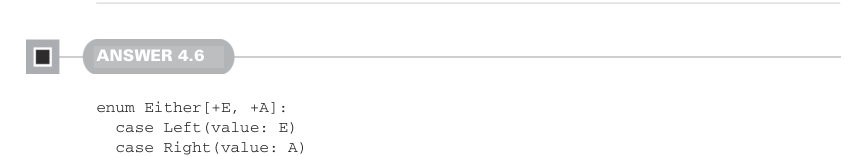

# Страница 0121

[<- Страница 0120](./page-0120)  
[Индекс страниц](./)  
[Страница 0122 ->](./page-0122)

> Часть 1: Введение в функциональное программирование / Глава 4: Обработка ошибок без исключений / Ответы на упражнения 4.6

функция. Разница чисто в том, что каждый элемент мы сначала прогоняем через `f`, а потом уже дёргаем `map2` — как будто аперитив перед основным блюдом. А чтобы слепить `sequence`, просто впариваем identity-функцию в `traverse`: входной список и так уже набит `Option`’ами (опционалами) под завязку, нехуй там преобразовывать.

```scala
def sequence[A](as: List[Option[A]]): Option[List[A]] =
traverse(as)(a => a)
```



#### Ответ 4.6

```scala
enum Either[+E, +A]:
case Left(value: E)
case Right(value: A)
def map[B](f: A => B): Either[E, B] = this match
case Right(value) => Right(f(value))
case Left(value) => Left(value)
def flatMap[EE >: E, B](f: A => Either[EE, B]): Either[EE, B] =
this match
case Right(value) => f(value)
case Left(value) => Left(value)
def orElse[EE >: E,B >: A](b: => Either[EE, B]): Either[EE, B] =
this match
case Right(value) => Right(value)
case Left(_) => b
def map2[EE >: E, B, C](that: Either[EE, B])(
f: (A, B) => C
): Either[EE, C] =
for
a <- this
b <- that
yield f(a, b)
```

Операции `map`, `flatMap` и `orElse` мы клепаем на классическом паттерн-матчинге — надёжно, как старый добрый `match`, без всякой хуйни. А `map2` лепим через `for-comprehension` (for/yield), который компилятор разжёвывает в цепочку `flatMap(a => that.map(b => f(a, b)))` — сахарный синтаксис, чтоб даже джуниоры не обосрались.


#### Ответ 4.7

Мы берём весь наш продакшеновый опыт с `sequence` и `traverse` для списков `Option`’ов (опционалов), слегка подкручиваем определения — и вуаля, работает как часы, без единого исключения (exception) в проде.

[<- Страница 0120](./page-0120)  
[Индекс страниц](./)  
[Страница 0122 ->](./page-0122)
