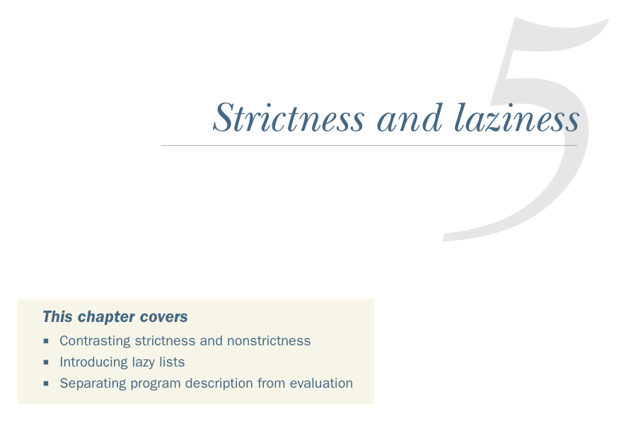

# Страница 0123
[<- Страница 0122](./page-0122) | [Индекс страниц](./) | [Страница 0124 ->](./page-0124)

> Часть 1: Введение в функциональное программирование / Глава 5: Строгость и ленивость



## Строгость и ленивость

### В этой главе мы разберём

- Сравнение строгости и нестрогости
- Знакомство с ленивыми списками
- Разделение описания программы от её вычисления

В третьей главе мы базарили про чисто функциональные структуры данных, на примере однонаправленных списков. Разобрали пачку массовых операций над списками: `map`, `filter`, `foldLeft`, `foldRight`, `zipWith` и так далее. Отметили, что каждая такая хрень делает свой отдельный проход по входным данным и лепит свежий список на выходе. Представь: у тебя колода карт, и тебе говорят — выкинь все нечётные, а потом переверни всех королев. В идеале — один свайп по колоде, ищешь и нечётные, и королев одновременно, как настоящий FP-мастер. Это ж в разы эффективнее, чем сначала нечётные выкинуть, а потом в остатке королев выискивать. А Scala-то как лох из 90-х: именно так и делает, блядь. Смотри на этот код[^1]:


```scala
scala> List(1,2,3,4).map(_ + 10).filter(_ % 2 == 0).map(_ * 3)
List(36,42)
```

[^1]: Теперь мы юзаем тип `List` из стандартной библиотеки Scala, где `map` и `filter` — это методы на `List`, а не standalone-функции (независимые функции), как мы сами ковыряли в третьей главе.

**94**

[<- Страница 0122](./page-0122) | [Индекс страниц](./) | [Страница 0124 ->](./page-0124)
