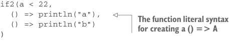

# Страница 0126
[<- Страница 0125](./page-0125) | [Индекс страниц](./) | [Страница 0127 ->](./page-0127)

> Часть 1: Введение в функциональное программирование / Глава 5: Строгость и ленивость / 5.1 Строгие и нестрогие функции

## 97 5.1 Строгие и нестрогие функции

```scala
if2(a < 22,
    () => println("a"),
    () => println("b")
)
```



> Синтаксис литерала функции для создания `() => A`

Аргументы `onTrue` и `onFalse` юзают свежий синтаксис, с которым мы ещё не еблись: тип `() => A`. 
Значение типа `() => A` — это функция, которая жрёт ноль аргументов и рыгает `A`<sup>3</sup>. 
В общем-то, неоценённая хрень от выражения зовётся *thunk'ом (thunk)* — как ленивый кусок кода, который лежит и ждёт, пока его не потыкают. 
Форсим этот thunk, вызывая функцию с пустыми скобками, типа `onTrue()` или `onFalse()`, и вуаля — результат на блюдечке. 
Вызывающие `if2` тоже вынуждены вручную thunk'и лепить, синтаксис тот же, что и для *function literal'ов (function literals)*, которые мы уже обосрали. 
Короче, этот подход делает картину кристально ясной: вместо каждого нестрогого параметра пихаем функцию без аргов, а в теле её явно дёргаем за ниточку, чтоб результат вылез. 
Можем её вызвать хоть десять раз, хоть ни разу — но это такой типичный цирк, что Scala подкинул сахарку послаще:

```scala
def if2[A](cond: Boolean, onTrue: => A, onFalse: => A): A =
  if cond then onTrue
  else onFalse
```

Теперь аргументы `onTrue` и `onFalse` имеют тип `=> A`. 
В теле функции с аргументом, помеченным `=>`, не надо ебаться — просто юзаем идентификатор как обычно, и он сам себя оценит. 
А для вызова этой хуйни ничего особенного: пишем обычный *function call (вызов функции)*, и Scala за нас оберёт выражение в thunk, чтоб не париться.

```scala
scala> if2(false, sys.error("fail"), 3)
res2: Int = 3
```

С любым из этих синтаксисов аргумент, который передали неоценённым, вычислятся каждый раз заново, где только на него сослались в теле функции. 
Scala по дефолту не кэширует эту херню, чтоб не плодить неожиданных оптимизаций:

```scala
scala> def maybeTwice(b: Boolean, i: => Int) = if b then i + i else 0
maybeTwice: (b: Boolean, i: => Int)Int
scala> val x = maybeTwice(true, { println("hi"); 1 + 41 })
hi
hi
x: Int = 84
```

Тут `i` ссылается два раза в теле `maybeTwice`, и мы это сделали особенно наглядным, засунув блок `{println("hi"); 1 + 41}` — он сперва напечатает `hi` как *side-effect (побочный эффект)*, а потом вернёт `42`. 
Выражение `1 + 41` вычисляется каждый раз заново.

<sup>3</sup> Фактически, тип `() => A` — это синтаксический алиас для типа `Function0[A]`.

[<- Страница 0125](./page-0125) | [Индекс страниц](./) | [Страница 0127 ->](./page-0127)
