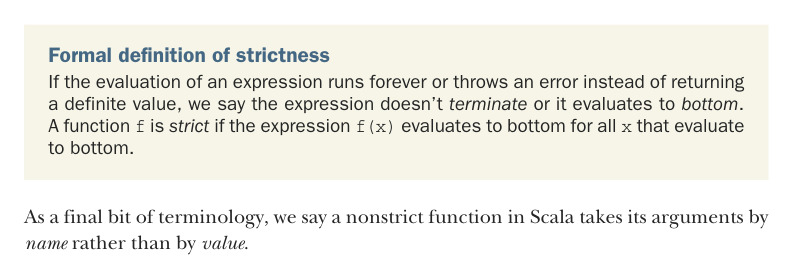
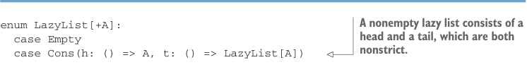

# Страница 0127
[<- Страница 0126](./page-0126) | [Индекс страниц](./) | [Страница 0128 ->](./page-0128)

> Часть 1: Введение в функциональное программирование / Глава 5: Строгость и ленивость / 5.2 Ленивые списки: Расширенный пример

тоже вычислится дважды, блядь, как и ожидалось. Хотим один раз — пихаем явно кеш через ключевое слово `lazy`:

```scala
scala> def maybeTwice2(b: Boolean, i: => Int) =
|
lazy val j = i
|
if b then j + j else 0
maybeTwice: (b: Boolean, i: => Int)Int
scala> val x = maybeTwice2(true, { println("hi"); 1 + 41 })
hi
x: Int = 84
```

Кидаешь `lazy` на объявление `val` — и Scala затормозит оценку правой стороны этой хуйни в объявлении `lazy` `val`, пока не дойдёт первая референса при разборе другого выражения. Плюс закеширует результат, чтоб повторные упоминания не запускали перевычисление заново — чистый продвинутый трюк, чтоб не ебаться с дубликатами.



Формальное определение строгости. Если оценка выражения улетает в бесконечный цикл или exception'ит вместо нормального значения, то выражение не *терминирует* или оценивается в *bottom* — классика, как бесконечный рекурсивный коллстек без хвостовой оптимизации. Функция `f` *строгая*, если её тело `f(x)` тонет в bottom при любом аргументе `x`, который сам по себе bottom. Поверь, я через такие подводные камни в проде прошёл — без этого понимания лень не завести.

Напоследок терминология: нестрогая функция в Scala жрёт аргументы *by name*, а не *by value* — как call-by-name в Scheme, только по-скалински, без лишнего говна.

### 5.2 Ленивые списки: Расширенный пример

Вернемся к той задаче с начала главы, пацаны. Разберём, как ленивость прокачивает эффективность и модульность FP-программ — на примере *ленивых списков*, это как бесконечные стримы, только без JVM-говна в памяти. Увидим, как цепочки map/filter/fold на них фьюзятся в один проход благодаря лени — никаких промежуточных коллекций, чистый fusion как в Haskell, только в Scala без монадного ада. В простом определении `LazyList` ниже пара новых фишек, сейчас разжуём по косточкам, чтоб не споткнулись, как я в первый раз.

Листинг 5.2. Простое определение для `LazyList`



> Непустой ленивый список — это голова и хвост, оба нестрогие, чтоб не жрать стек сразу.

```scala
enum LazyList[+A]:
case Empty
case Cons(h: () => A, t: () => LazyList[A])
object LazyList:
def cons[A](
hd: => A, tl: => LazyList[A]
): LazyList[A] =
lazy val head = hd
lazy val tail = tl
Cons(() => head, () => tail)
```


> Смарт-конструктор для создания непустого ленивого списка

> Кешируем голову и хвост как lazy-значения, чтоб избежать повторных вычислений — без этого твоя рекурсия сожрёт всё к хуям.

[<- Страница 0126](./page-0126) | [Индекс страниц](./) | [Страница 0128 ->](./page-0128)
