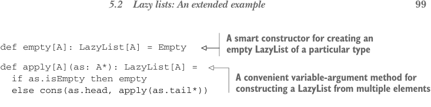
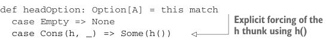

# Страница 0128

[<- Страница 0127](./page-0127) | [Индекс страниц](./) | [Страница 0129 ->](./page-0129)

> Часть 1: Введение в функциональное программирование / Глава 5: Строгость и ленивость / 5.2 Ленивые списки: Расширенный пример / 5.2.1 Мемоализация ленивых списков и избежание повторных вычислений



## 99 5.2 Ленивые списки: Расширенный пример

> Умный конструктор для сборки пустого LazyList нужного типа — без лишней хуйни

```scala
def empty[A]: LazyList[A] = Empty
def apply[A](as: A*): LazyList[A] =
if as.isEmpty then empty
else cons(as.head, apply(as.tail*))
```

> Удобный метод с переменным числом аргументов, чтоб слепить LazyList из кучи элементов

Этот тип выглядит в точности как наш `List`, только конструктор данных `Cons` жрёт *явные* thunk'и (`() => A` и `() => LazyList[A]`), а не строгие значения по умолчанию. Используем явные thunk'и, потому что Scala не позволяет by-name параметры (by-name parameters) в case-классах (а каждый конструктор enum'а с параметрами — это case-класс под капотом).[^4]

Хочешь заглянуть в `LazyList` или пройтись по нему — форсишь эти thunk'и, как мы раньше ковырялись в определении `if2`. Например, вот метод, чтоб опционально вытащить голову из `LazyList` на типе `LazyList`:



```scala
def headOption: Option[A] = this match
case Empty => None
case Cons(h, _) => Some(h())
```

> Явный форс thunk'а h через h() — пинаем лентяя, чтоб проснулся

Обратите внимание, `h` форсим явно через `h()`, но в остальном код работает как с `List`. А эта фича `LazyList` — вычислять только то, что реально просят (хвост `Cons` не трогаем) — окажется охуенно полезной, как увидим дальше.

### 5.2.1 Мемоализация ленивых списков и избежание повторных вычислений

Обычно хочется кэшировать значения Cons-ноды, как только их форсили — чтоб не пересчитывать заново, как тот кот из мема, который дважды кофе варит. Если лепить Cons напрямую, то вот этот код `expensive(x)` просчитает два раза, и ты будешь материться на код-ревью:

```scala
val x = Cons(() => expensive(x), tl)
val h1 = x.headOption
val h2 = x.headOption
```

Избегаем этой подставы *умными* конструкторами — это когда функция строит тип с доп. гарантиями или другой сигнатурой, чем сырые для паттерн-матчинга. По традиции, первую букву в нижний регистр. Наш `cons` как раз мемоизирует by-name аргументы (by-name arguments) головы и хвоста `Cons`. Классический приёмчик из FP-арсенала, thunk отработает строго один раз при первом форсе, а дальше из кэша достанем `lazy val`:

```scala
def cons[A](hd: => A, tl: => LazyList[A]): LazyList[A] =
lazy val head = hd
lazy val tail = tl
Cons(() => head, () => tail)
```

[^4]: Эта хрень из-за того, что каждый параметр case-класса генерит `public val`.

[<- Страница 0127](./page-0127) | [Индекс страниц](./) | [Страница 0129 ->](./page-0129)
