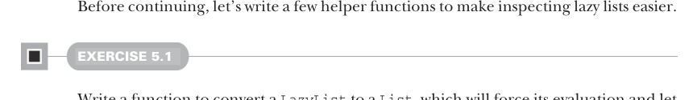

# Страница 0129
[<- Страница 0128](./page-0128) | [Индекс страниц](./) | [Страница 0130 ->](./page-0130)

> Часть 1: Введение в функциональное программирование / Глава 5: Строгость и ленивость / 5.2 Ленивые списки: Расширенный пример / 5.2.2 Вспомогательные функции для инспекции ленивых списков

Каждый раз, когда в результирующем `LazyList` ты апеллируешь к thunk'у `head`, Scala возвращает значение этого ленивого `val head`. Если оно уже просчитано и закешировано — отдаёт из кэша, как пиво из холодильника после первой банки. Нет — вычисляет на лету, кэширует и выдаёт. Этот умный конструктор, блядь, как идеальный компромисс: не нужно вручную thunk'и лепить на месте вызова `Cons`, не париться с кэшированием — считается ровно один раз, и все плюшки case-классов при тебе, включая паттерн-матчинг без гемора:

```scala
def empty[A]: LazyList = Empty
```

Умный конструктор `empty` просто возвращает `Empty`, но оборачивает его в `LazyList[A]`, что спасает вывод типов в некоторых угловых случаях.[^5]

```scala
def apply[A](as: A*): LazyList[A] =
if as.isEmpty then empty
else cons(as.head, apply(as.tail*))
```

Снова Scala сама thunk'ами обёртывает аргументы `cons`, так что выражения `as.head` и `apply(as.tail*)` не шелохнутся, пока не форсишь `LazyList` — чистая лень в деле. Но аргумент `as` в `apply` строгий, сука! При вызове `apply` каждый отдельный `A` вычисляется заранее, до того, как тело функции отработает. Чтобы отложить оценку каждого аргумента до форса результирующего `LazyList`, пришлось бы сделать каждый `A` by-name. Типа `def apply[A](as:` `(=>` `A*): LazyList[A]`, но Scala такой синтаксис на дух не переносит. Другие способы лениво строить `LazyList` разберём позже в этой главе.

### 5.2.2 Вспомогательные функции для инспекции ленивых списков



Прежде чем рвать дальше, замутим пару хелперов — чтоб инспектировать ленивые списки было не как дебажить чёрный ящик в продакшене ночью.

#### УПРАЖНЕНИЕ 5.1

Напиши функцию, которая конвертит `LazyList` в обычный `List` — форсит всю оценку и можно в REPL (Read-Eval-Print Loop) нормально разглядеть, что там внутри. Конвертируй в стандартный `List` из стэблы (stdlib), и засунешь эту фичу вместе с другими методами по `LazyList` прямо внутрь enum `LazyList`:

```scala
def toList: List[A]
```

[<- Страница 0128](./page-0128) | [Индекс страниц](./) | [Страница 0130 ->](./page-0130)

[^5]: Напомню, Scala использует субтайпинг для представления конструкторов данных (data constructors), но нам почти всегда нужен вывод именно `LazyList`, а не `Cons` или `Empty`. Делать умные конструкторы, возвращающие базовый тип — классический трюк, который в Scala 2 был must-have, а в Scala 3 уже не так критичен, потому что она предпочитает выводить тип enum (типа `LazyList[A]`), а не конструктора (типа `Cons[A]`). Видно, как оба умных конструктора юзаются в `LazyList.apply`.
