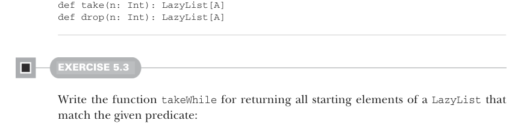

# Страница 0130

[<- Страница 0129](./page-0129) | [Указатель страниц](./) | [Страница 0131 ->](./page-0131)

> Часть 1: Введение в функциональное программирование / Глава 5: Строгость и ленивость / 5.3 Разделение описания программы от вычисления

## 101 5.3 Разделение описания программы от вычисления


#### УПРАЖНЕНИЕ 5.2

Напиши функцию `take(n)`, чтоб она возвращала первые `n` элементов `LazyList`, и `drop(n)`, чтоб пропускала первые `n` элементов `LazyList`. Определи эти функции внутри enum `LazyList`:



```scala
def take(n: Int): LazyList[A]
def drop(n: Int): LazyList[A]
```

#### УПРАЖНЕНИЕ 5.3

Напиши функцию `takeWhile`, чтоб она возвращала все начальные элементы `LazyList`, которые матчатся с заданным предикатом:

```scala
def takeWhile(p: A => Boolean): LazyList[A]
```

Можешь юзать `take` и `toList` вместе, чтоб инспектировать ленивые списки в REPL. Например, попробуй напечатать `LazyList(1,2,3).take(2).toList`.

### 5.3 Разделение описания программы от вычисления

В функциональном программировании одна из главных тем — это *разделение забот*, блядь. Мы хотим отделить описание вычислений от их реального запуска, как будто строим чертеж ракеты, а не сразу её запускаем в космос. Мы уже тыкались в эту тему в прошлых главах разными способами — помните, first-class функции ловят вычисления в своём теле, но выполняют их только когда аргументы подвалили? А с `Option` мы фиксировали факт ошибки, а решение, что с ней делать, вынесли в отдельную заботу, чтоб не путаться в ногах. А с `LazyList` мы вообще строим вычисление, которое генерит последовательность элементов, но не ебём мозги шагам этого вычисления, пока элементы не понадобятся. В общем, ленивость позволяет отделить *описание* выражения от его *вычисления* — это как метафора из жизни: планируешь эпичное код-ревью, но проводишь только то, что реально нужно, а остальное на полке лежит. Получается мощная хуйня: описываешь огромную хрень, а вычисляешь только кусок. Взять для примера функцию `exists`, которая проверяет, есть ли в этом `LazyList` элемент, матчащийся с функцией `Boolean`:

```scala
def exists(p: A => Boolean): Boolean = this match
case Cons(h, t) => p(h()) || t().exists(p)
case _ => false
```

Обратите внимание, `||` нестрогая по второму аргументу. Если `p(h())` вернёт `true`, то `exists` прервёт обход досрочно и тоже вернёт `true`. И не забывайте, что хвост

[<- Страница 0129](./page-0129) | [Указатель страниц](./) | [Страница 0131 ->](./page-0131)
