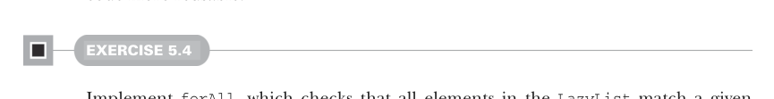
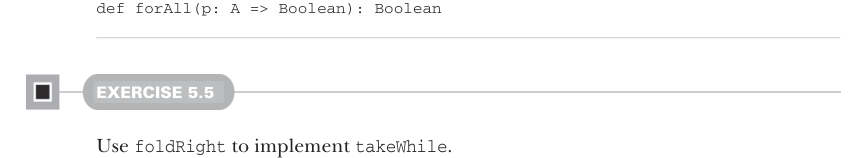

# Страница 0131

[<- Страница 0130](./page-0130) | [Индекс страниц](./) | [Страница 0132 ->](./page-0132)

> Часть 1: Введение в функциональное программирование / Глава 5: Строгость и ленивость / 5.3 Отделение описания программы от вычисления

Ленивый список — это `lazy val` (ленивое значение), так что не только обход тормозит на первом же фейле, но и хвост этого ленивого ублюдка вообще никогда не просыпается! 
Код, который должен был бы его генерить, просто лежит мёртвым грузом и не выполняется ни хуя. 

Функция `exists` здесь на явной рекурсии, как в старые добрые времена. Но вспомни из главы 3: с `List` (списком) мы можем обобщить эту херню в виде `foldRight` (правого сворачивания). 
То же самое провернём для `LazyList` (ленивого списка), но по-ленивому, чтоб не париться:

> Стрелка `=>` перед типом аргумента `B` значит, что функция `f` жрёт второй аргумент по имени и может тупо его игнорить, не вычисляя. 
> Если `f` не тронет второй аргумент — рекурсия даже не чихнёт.

```scala
def foldRight[B](acc: => B)(f: (A, => B) => B): B =
  this match
    case Cons(h, t) => f(h(), t().foldRight(acc)(f))
    case _ => acc
```

Это до хуя похоже на `foldRight`, что мы слепили для `List`, но врубайся: наша комбайн-функция `f` нестрогая во втором параметре, как истинный FP-хулиган. 
Если `f` решит не ковырять второй аргумент — обход наебнётся досрочно; видим это в деле, когда юзаем `foldRight` для `exists`[^6]:

```scala
def exists(p: A => Boolean): Boolean =
  foldRight(false)((a, b) => p(a) || b)
```

Здесь `b` — это спящий рекурсивный шаг, который фолдит хвост ленивого списка, как зомби в *Resident Evil*, ждёт пинка. 
Если `p(a)` свалит по-тихому, `true b` так и останется в спячке, и вся херня завершится раньше срока. 

Раз `foldRight` может рубить обход на корню, мы её переиспользуем для `exists` — с строгой версией `foldRight` такое не прокатит, пришлось бы городить специальную рекурсивную `exists` под *early termination* (досрочное завершение), как в каком-то legacy-кошмаре. 
Ленивость — это когда код становится универсальным, как швейцарский нож, а не одноразовый презик.



#### УПРАЖНЕНИЕ 5.4

Реализуй `forAll` (для всех), которая проверяет, что все элементы в `LazyList` матчатся с предикатом. 
Твоя имплементация должна ебать обход в жопу, как только нарвётся на нематчащий элемент:



```scala
def forAll(p: A => Boolean): Boolean
```

#### УПРАЖНЕНИЕ 5.5

Используй `foldRight` для реализации `takeWhile` (взять пока).

[^6]: Эта дефиниция `exists`, хоть и для наглядности, не *stack-safe* (стекобезопасная) на большом ленивом списке, где все элементы проходят `false` — *stack overflow* (переполнение стека), как в мои первые годы с FP, привет из 2008-го.

[<- Страница 0130](./page-0130) | [Индекс страниц](./) | [Страница 0132 ->](./page-0132)
