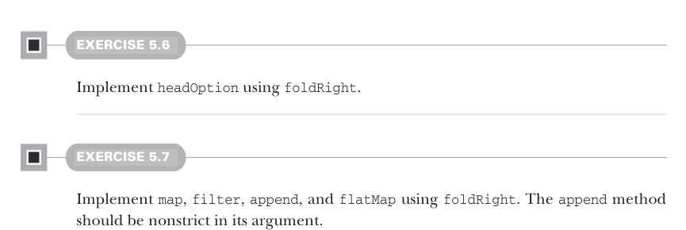
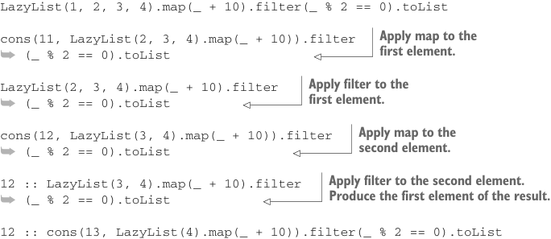

# Страница 0132

[<- Страница 0131](./page-0131) | [Оглавление страниц](./) | [Страница 0133 ->](./page-0133)

> Часть 1: Введение в функциональное программирование / Глава 5: Строгость и ленивость / 5.3 Отделение описания программы от вычисления

## 103 5.3 Отделение описания программы от вычисления



#### УПРАЖНЕНИЕ 5.6

Заточите под капот `headOption` на базе `foldRight`.

#### УПРАЖНЕНИЕ 5.7

Заточите `map`, `filter`, `append` и `flatMap` на базе `foldRight`. 
Метод `append` должен быть нелеёвым (non-strict) по аргументу — чтоб не жрал его сразу, как голодный тролль из подвала.

Обратите внимание, эти реализации — чистый *инкрементальный* кайф, бля: они не вываливают весь ответ разом, как джуниор на дедлайне. 
Только когда какая-то другая хрень полезет ковырять элементы в итоговом `LazyList`, машина реально запустит генерацию этого `LazyList` — и сделает ровно минимум работы, чтоб выдать запрошенные элементы, не больше. 
Из-за этой ленивой инкрементальности мы можем цеплять функции одну за другой, не раздувая память промежуточным говном до небес. 
Взгляните на упрощённый трассировщик программы для (кусочка) того мотивирующего примера, с которого мы стартанули эту главу: 
`LazyList(1, 2, 3, 4).map(_ + 10).filter(_ % 2 == 0)`. 
Мы зафорсим оценку, обернув это в `List`. 
Потратьте минуту, разберите трассировщик шаг за шагом — поймёте, как лень работает под капотом. 
Он посложнее того, что мы ковыряли раньше в главе, но это как debug в проде: повторяешь одно и то же выражение, каждый раз на шаг глубже в безумие, пока не щёлкнет.

Листинг 5.3 Трассировщик программы для `LazyList`



```scala
LazyList(1, 2, 3, 4).map(_ + 10).filter(_ % 2 == 0).toList
```

> Применяем map к первому элементу.

```scala
cons(11, LazyList(2, 3, 4).map(_ + 10)).filter
➥ (_ % 2 == 0).toList
```

> Применяем filter к первому элементу.

```scala
LazyList(2, 3, 4).map(_ + 10).filter
➥ (_ % 2 == 0).toList
```

> Применяем map ко второму элементу.

```scala
cons(12, LazyList(3, 4).map(_ + 10)).filter
➥ (_ % 2 == 0).toList
```

> Применяем filter ко второму элементу. Выдаём первый элемент результата.

```scala
12 :: LazyList(3, 4).map(_ + 10).filter
➥ (_ % 2 == 0).toList
12 :: cons(13, LazyList(4).map(_ + 10)).filter(_ % 2 == 0).toList
12 :: LazyList(4).map(_ + 10).filter(_ % 2 == 0).toList
12 :: cons(14, LazyList().map(_ + 10)).filter(_ % 2 == 0).toList
```

[<- Страница 0131](./page-0131) | [Оглавление страниц](./) | [Страница 0133 ->](./page-0133)
