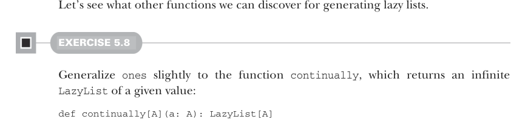

# Страница 0134

[<- Страница 0133](./page-0133) | [Индекс страниц](./) | [Страница 0135 ->](./page-0135)

> Часть 1: Введение в функциональное программирование / Глава 5: Строгость и ленивость / 5.4 Бесконечные ленивые списки и корекурсия

## 105 5.4 Бесконечные ленивые списки и корекурсия

```scala
scala> ones.take(5).toList
res0: List[Int] = List(1, 1, 1, 1, 1)
scala> ones.exists(_ % 2 != 0)
res1: Boolean = true
```

Поиграйся с парой других примеров, чтоб прочувствовать:

```scala
ones.map(_ + 1).exists(_ % 2 == 0)
ones.takeWhile(_ == 1)
ones.forAll(_ != 1)
```

В каждом случае результат вылетает мгновенно. Только аккуратно, пацаны, нехуй слепить выражения, которые либо никогда не кончатся, либо стек тебе угробят. Например, `ones.forAll(_ == 1)` будет вечно ковыряться в этой серии глубже и глубже, потому что хуй найдёт элемент, который позволит завершить с чётким вердиктом (проявится как стек-оверфлоу (stack overflow), а не бесконечный луп).7


**Бесконечный ленивый список**

> Ones  
> Ones

```scala
1
```

`1 1 1 1...`

=

`ones.take(3) => [1, 1, 1]`

`ones` — это ленивый хуй, который на себя ссылается хвостом; генерит бесконечный поток единичек. Выражения, которые жрут только конечное число элементов ленивого списка, могут жрать бесконечный ленивый список на входе и не сдохнуть.

> Многие функции можно вычислить с конечными ресурсами, даже если их вход генерит бесконечные последовательности.

Рисунок 5.1 Бесконечный ленивый список



Давай откопаем ещё функции для генерации ленивых списков, пока разогнались.

#### УПРАЖНЕНИЕ 5.8

Обобщить `ones` чутка до функции `continually`, которая возвращает бесконечный `LazyList` заданного значения:

```scala
def continually[A](a: A): LazyList[A]
```

7 Можно stack-safe (безопасную для стека) версию `forAll` на обычной рекурсивной петле.

[<- Страница 0133](./page-0133) | [Индекс страниц](./) | [Страница 0135 ->](./page-0135)
