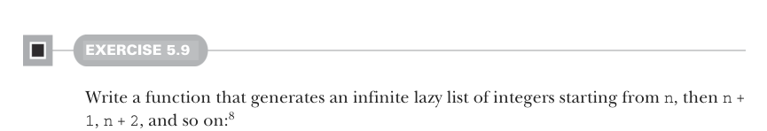
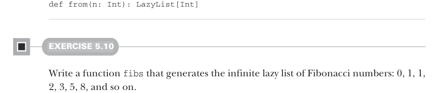

# Страница 0135

[<- Страница 0134](./page-0134) | [Указатель страниц](./) | [Страница 0136 ->](./page-0136)

> Часть 1: Введение в функциональное программирование / Глава 5: Строгость и ленивость / 5.4 Бесконечные ленивые списки и корекурсия



#### УПРАЖНЕНИЕ 5.9

Слепите функцию, которая генерит бесконечный ленивый список целых чисел, 
начиная с `n`, потом `n + 1`, `n + 2` — и так по нарастающей.[^8]



```scala
def from(n: Int): LazyList[Int]
```

#### УПРАЖНЕНИЕ 5.10

Напишите функцию `fibs`, которая генерит бесконечный ленивый список чисел Фибоначчи: 
0, 1, 1, 2, 3, 5, 8 — и дальше в бесконечность.


#### УПРАЖНЕНИЕ 5.11

Напишите более общую функцию для сборки `LazyList` под названием `unfold`. 
Она принимает начальное состояние `S` и функцию, которая из него производит 
и следующее состояние, и следующий элемент для ленивого списка:

```scala
def unfold[A, S](state: S)(f: S => Option[(A, S)]): LazyList[A]
```

`Option` (для сигнала остановки) используется, чтоб сигнализировать, 
когда `LazyList` пора тормозить (если вообще). 
Функция `unfold` — это ультра-универсальный фабричный метод для `LazyList`.

Функция `unfold` — классический пример *корекурсивной* функции. 
Рекурсия жрёт данные, как голодный хомяк семечки, а корекурсия их рождает, 
как фабрика на стероидах. Рекурсивные функции отъедают по кусочку и сходят на ноль, 
а корекурсивные не обязаны финишировать, главное — чтоб были *продуктивны*, 
то есть всегда можно выдавить ещё один элемент результата за конечное время, 
без вечного ожидания. `unfold` продуктивна, пока `f` отрабатывает за разумное время — 
просто запускаем `f` ещё разок, и вуаля, следующий элемент `LazyList` готов. 
Корекурсию иногда зовут охраняемой *рекурсией*, а продуктивность — *котерминацией*. 
Термины эти не супер-критичны для нашей тусовки, но в FP-тусовке их кидают, 
чтоб понтануться. Если жжёт узнать, откуда ноги растут и какие там глубокие связи — 
копайте рефы в нотках главы (https://github.com/fpinscala/fpinscala/wiki).

[<- Страница 0134](./page-0134) | [Указатель страниц](./) | [Страница 0136 ->](./page-0136)

[^8]: В Скале `Int` — это 32-битный signed integer (знаковый 32-битный целый), 
так что этот ленивый список когда-нибудь перекинется через максимум в минуса 
и зациклится после четырёх миллиардов элементов, как старая Java-машина на переполнении.
