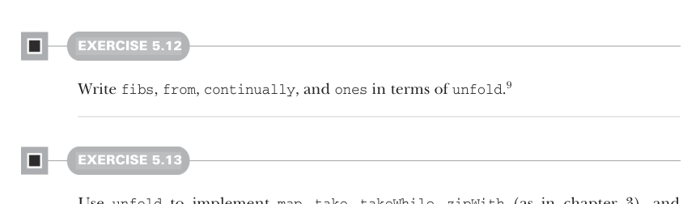

# Страница 0136
[<- Страница 0135](./page-0135) | [Индекс страниц](./) | [Страница 0137 ->](./page-0137)

> Часть 1: Введение в функциональное программирование / Глава 5: Строгость и ленивость / 5.4 Бесконечные ленивые списки и корекурсия

## 107 5.4 Бесконечные ленивые списки и корекурсия



#### УПРАЖНЕНИЕ 5.12

Напиши `fibs`, `from`, `continually` и `ones` через `unfold`.[^9]

#### УПРАЖНЕНИЕ 5.13

Используй `unfold`, чтоб реализовать `map`, `take`, `takeWhile`, `zipWith` (как в третьей главе) и `zipAll`. Функция `zipAll` должна продолжать обход, пока в любом из ленивых списков есть элементы; она использует `Option` (опциональный тип), чтоб понять, иссяк ли список:

```scala
def zipAll[B](that: LazyList[B]): LazyList[(Option[A], Option[B])]
```

Теперь, когда мы набили руку на функциях для ленивых списков — как после код-ревью, где сам себя потрепал, — вернёмся к той задаче из конца третьей главы: функция `hasSubsequence`, чтоб проверить, есть ли в списке заданная подпоследовательность. С строгими списками и их обработкой мы вынуждены были городить хитрый монолитный цикл, чтоб не просрать лишние такты CPU. А с ленивыми — видишь, как можно слепить `hasSubsequence` из уже готовых фич?[^10] Подумай сам, без подсказок, как настоящий FP-ветеран, перед тем как дальше.


#### УПРАЖНЕНИЕ 5.14

*Сложное*: Реализуй `startsWith` через уже написанные функции. Она должна проверить, является ли один `LazyList` префиксом другого. Например, `LazyList(1,2,3).startsWith(LazyList(1,2))` даст `true`:

```scala
def startsWith[A](prefix: LazyList[A]): Boolean
```

[^9]: Использование `unfold` для определения `continually` и `ones` не даёт того шаринга, что в рекурсивном варианте  
    `val ones: LazyList[Int] = cons(1, ones)`.  
    Рекурсивный жрёт константную память, даже если держишь на него ссылку во время обхода, а на базе `unfold` — нет.  
    Шаринг (sharing) в ленивых списках — штука хрупкая, как стек в рекурсии без хвостовой оптимизации (tail call optimization), и типы её не трекают.  
    Достаточно вызвать даже `xs.map(x => x)` — и привет, шаринг в помойку.

[^10]: Этот мини-пример сборки `hasSubsequence` из простых функций через лень придумал Cale Gibbard. Смотри пост: https://mng.bz/aPP9.

[<- Страница 0135](./page-0135) | [Индекс страниц](./) | [Страница 0137 ->](./page-0137)
