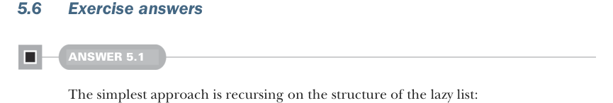

# Страница 0139
[<- Страница 0138](./page-0138) | [Индекс страниц](./) | [Страница 0140 ->](./page-0140)

> Часть 1: Введение в функциональное программирование / Глава 5: Строгость и ленивость / 5.6 Ответы на упражнения

- Функция `unfold`, которая генерит `LazyList` из сида и функции, — это чистая коркурсия в действии. Такие коркурсивные твари плодят данные бесконечно, и пока они продуктивны, код бежит как часы, не стопорясь.



### 5.6 Ответы на упражнения

#### РЕШЕНИЕ 5.1

Самый примитивный подход — рекурсировать по структуре ленивого списка, как по костяку:

```scala
def toList: List[A] = this match
case Cons(h, t) => h() :: t().toList
case Empty => Nil
```

Как мы уже настрадались в третьей главе, такие рекурсивные определения — не stack-safe (безопасные для стека), потому что после рекурсивного вызова ещё ковыряются в результате, жрут стек как не в себя. Чтобы не ебаться с переполнением стека, пишем хвостовую рекурсию:

```scala
def toList: List[A] =
@annotation.tailrec
def go(ll: LazyList[A], acc: List[A]): List[A] =
ll match
case Cons(h, t) => go(t(), h() :: acc)
case Empty => acc.reverse
go(this, Nil)
```


#### РЕШЕНИЕ 5.2

Сначала реализуем `take`:

```scala
def take(n: Int): LazyList[A] = this match
case Cons(h, t) if n > 1 => cons(h(), t().take(n - 1))
case Cons(h, t) if n == 1 => cons(h(), empty)
case _ => empty
```

Если у нас есть `Cons` и нужно взять больше одного элемента, возвращаем новый `Cons`, где голова — оригинальная, а хвост — рекурсивный вызов `take` на хвосте с уменьшенным на единицу `n`. А вот кейс, когда `n` равно 1, поинтереснее — могли бы и без него обойтись, вычислив правильный ответ, но это заставило бы вычислить хвост зря из-за `t().take(n - 1)`. Глупо тратить циклы на хвост, который тут же в помойку, так что специальный кейс для одного элемента — в самый раз. Точно так же, когда `n` равно 0, не форсим ни голову, ни хвост. Про эту ленивую подлость разберёмся подробнее в следующей секции, там как на ладони будет.

[<- Страница 0138](./page-0138) | [Индекс страниц](./) | [Страница 0140 ->](./page-0140)
