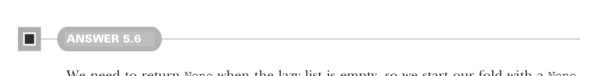

# Страница 0141

[<- Страница 0140](./page-0140) | [Указатель страниц](./) | [Страница 0142 ->](./page-0142)

> Часть 1: Введение в функциональное программирование / Глава 5: Строгость и ленивость / Разборы упражнений 5.6



#### ОТВЕТ 5.6

Бля, нам надо вернуть `None`, если ленивый лист пустой,  
так что фолд стартуем аккуратно с `None`.  

Дальше, когда элемент прилетает с аккумом  
(это ленивая часть нашей вычислухи, типа спящий медведь),  
просто заворачиваем элемент в `Some` и плюём на аккум нахер.  

Аккум отбрасывается в утиль,  
и остаток ленивого листа так и висит неоценённым — чистый кайф лени:


```scala
def headOption: Option[A] =
foldRight(None: Option[A])((a, _) => Some(a))
```

#### ОТВЕТ 5.7

Для `map` строим по каждому элементу классический `Cons`,  
где элемент трансформируем поданной функцией —  
как конвейер на заводе, только ленивый:

```scala
def map[B](f: A => B): LazyList[B] =
foldRight(empty[B])((a, acc) => cons(f(a), acc))
```

Тут же `filter`: тестим элемент по предикату,  
если прошёл — лепим `Cons`, нет — пропускаем,  
как фильтр на входе в клуб:

```scala
def filter(p: A => Boolean): LazyList[A] =
foldRight(empty[A])((a, acc) => if p(a) then cons(a, acc) else acc)
```

А `append` поинтереснее, с подвохом:

```scala
def append[A2 >: A](that: => LazyList[A2]): LazyList[A2] =
foldRight(that)((a, acc) => cons(a, acc))
```

Аргумент аппенда берём by-name — чтоб не вычислялся зря, пока не припрется.  
Плюс тип-параметр `A2` как супертип `A`,  
иначе компилятор взвоет про variance (знакомо, да? классика Scala-ебли).  

Если б делали standalone функцией, а не методом на `LazyList`,  
variance бы не ебала.  

Фолд стартуем с аппендируемого листа,  
а каждый элемент оригинала cons'им на аккум —  
как склеиваем два поезда хвостом к хвосту.  

Наконец, `flatMap` через `append` — просто и элегантно:

```scala
def flatMap[B](f: A => LazyList[B]): LazyList[B] =
foldRight(empty[B])((a, acc) => f(a).append(acc))
```

[<- Страница 0140](./page-0140) | [Указатель страниц](./) | [Страница 0142 ->](./page-0142)
