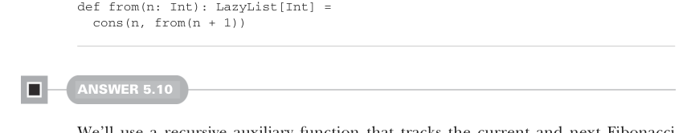

# Страница 0142

[<- Страница 0141](./page-0141) | [Указатель страниц](./) | [Страница 0143 ->](./page-0143)

> Часть 1: Вступ в функциональное программирование / Глава 5: Строгость и лень / 5.6 Разборы упражнений

## 113 5.6 Разборы упражнений


#### РАЗБОР 5.8

Простенькое определение выходит, если просто заменить 1 на `a` — как два пальца:

```scala
def continually[A](a: A): LazyList[A] =
cons(a, continually(a))
```

Более крутая реализация выделяет одну-единственную `Cons`-ячейку, которая смотрит сама на себя, как в зеркало нарцисса, — и никаких лишних аллокаций, чистый FP-вайб:

```scala
def continually[A](a: A): LazyList[A] =
lazy val single: LazyList[A] = cons(a, single)
single
```


#### РАЗБОР 5.9

Слепливаем `Cons`, где голова — чистый `n`, а хвост — рекурсивный вызов `from` с `n + 1`. Как в `ones` и `continually`, эта бесконечная рекурсия — полная безопасность, хвост не дёрнется, пока сам не заставишь, лень спасает от стек-оверфлоу (stack overflow), как супергерой в плаще:



```scala
def from(n: Int): LazyList[Int] =
cons(n, from(n + 1))
```

#### РАЗБОР 5.10

Берём рекурсивную вспомогательку, которая тащит текущий и следующий числа Фибоначчи (Fibonacci), как рюкзак туриста. Когда её трогаешь — выдаёт ленивый список: голова с текущим фибоначчи, хвост — рекурсия, где следующий прыгает в голову, а новый следующий — сумма `current` и `next`, классика, пацаны, без неё никуда:

```scala
val fibs: LazyList[Int] =
def go(current: Int, next: Int): LazyList[Int] =
cons(current, go(next, current + next))
go(0, 1)
```

Кстати, определяем это как `val`, а не как `def` — и вся бесконечная последовательность не материализуется в памяти целиком, как стадо слонов в твоём хипе (heap), лень рулит.

[<- Страница 0141](./page-0141) | [Указатель страниц](./) | [Страница 0143 ->](./page-0143)
