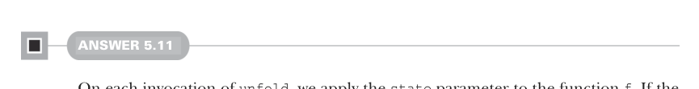

# Страница 0143

[<- Страница 0142](./page-0142) | [Указатель страниц](./) | [Страница 0144 ->](./page-0144)

> Часть 1: Введение в функциональное программирование / Глава 5: Строгость и ленивость / 5.6 Ответы на упражнения



#### ОТВЕТ 5.11

Каждый раз при вызове `unfold` мы берём параметр `state` и пихаем его в функцию `f`. Если она отваливается и выдаёт `None` — ну всё, хана, возвращаем пустой ленивый список, как мертвеца в гроб. А иначе консим сгенерированное значение вперёд того ленивого списка, который вылазит из рекурсивного `Cons` с свежим состоянием. И снова рекурсия не взорвёт стек, потому что `Cons` — ленивый хитрожопый тип, аргументы жрёт только по требованию, как кот корм:

```scala
def unfold[A, S](state: S)(f: S => Option[(A, S)]): LazyList[A] =
f(state) match
case Some((a, s)) => cons(a, unfold(s)(f))
case None => empty
```


#### ОТВЕТ 5.12

Наша рекурсивная `fibs` передаёт в рекурсивный вызов два параметра: `current` и `next`. Чтобы запихнуть это в `unfold` как состояние, просто суём их в тюпл — и вуаля, состояние готово, как бутер с колбасой:

```scala
val fibs: LazyList[Int] =
unfold((0, 1)): case (current, next) =>
Some((current, (next, current + next)))
```

Аналогично, для `from` состояние — это следующий инт, который пора выплюнуть:

```scala
def from(n: Int): LazyList[Int] =
unfold(n)(n => Some((n, n + 1))
```

Остальным функциям состояние нахуй не сдалось, так что пихаем любой мусор. Обычно юнит `()` — чтоб все видели, что это декоративный хуй, не юзаем:

```scala
def continually[A](a: A): LazyList[A] =
unfold(())(_ => Some((a, ())))
```


```scala
val ones: LazyList[Int] =
unfold(())(_ => Some((1, ())))
```

#### ОТВЕТ 5.13

Как и в прошлом упражнении, фишка в том, чтоб угадать, какое состояние тащить в `unfold`. Для реализации `map` берём нетронутый список как состояние — классика, как старый добрый `foldLeft`, который жрёт аккумулятор:

[<- Страница 0142](./page-0142) | [Указатель страниц](./) | [Страница 0144 ->](./page-0144)
