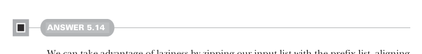
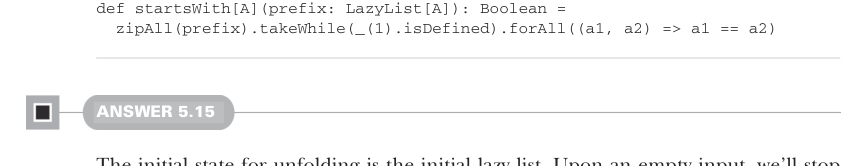
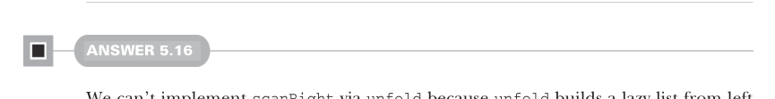

# Страница 0145
[<- Страница 0144](./page-0144) | [Индекс страниц](./) | [Страница 0146 ->](./page-0146)

> Часть 1: Введение в функциональное программирование / Глава 5: Строгость и ленивость / 5.6 Ответы на упражнения



#### ОТВЕТ 5.14

Мы можем выжать из ленивости весь сок, зазипив входной список с префиксом — элементы встанут как солдатыки в шеренгу, и процесс затормозится аккурат на конце префикса. А потом вернём `true`, если все пары совпадут, как близнецы-братья из одного помёта:



```scala
def startsWith[A](prefix: LazyList[A]): Boolean =
zipAll(prefix).takeWhile(_(1).isDefined).forAll((a1, a2) => a1 == a2)
```

#### ОТВЕТ 5.15

Начальное состояние для разворачивания — это сам исходный ленивый список. Пустой вход? Сворачиваем шлагбаум и стопоримся. Непустой? Эмитируем список целиком и разворачиваем его хвост дальше. В финале прилепляем пустой ленивец в хвост, вызывая `append` на результате `unfold` — классика жанра:

```scala
def tails: LazyList[LazyList[A]] =
unfold(this):
case Empty => None
case Cons(h, t) => Some((Cons(h, t), t()))
.append(LazyList(empty))
```

В паттерн-матче фигачим новую синтаксическую конфетку — `case l @ Cons(_, t)` — она биндит `l` прямиком к совпавшему паттерну `Cons(_, t)`. Зачем? Чтоб не плодить лишние `Cons`-объекты при возврате эмитируемого значения, экономим память, как в продакшене на каждом байте дерёмся.



#### ОТВЕТ 5.16

`scanRight` через `unfold` не прокатит — тот строит ленивый список слева направо, как конвейер в одну сторону, без разворота. Берем `foldRight` с лёгким тюнингом: вместо сворачивания всего в один `B` накапливаем элементы в полноценный `LazyList[B]`:

```scala
def scanRight[B](init: B)(f: (A, => B) => B): LazyList[B] =
foldRight(init -> LazyList(init)): (a, b0) =>
lazy val b1 = b0
val b2 = f(a, b1(0))
(b2, cons(b2, b1(1)))
.apply(1)
```

Аккумулятор нашего `foldRight` — это тюпл `(B, LazyList[B])`: первый элемент — последний свежесчитанный `B` (или нулевое значение (zero-value), если ещё не запустились), второй — вся предыстория всех посчитанных `B`, как лог всех транзакций в блокчейне. Для каждого

[<- Страница 0144](./page-0144) | [Индекс страниц](./) | [Страница 0146 ->](./page-0146)
