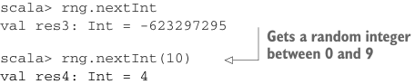
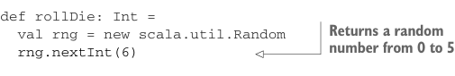

# Страница 0148

[<- Страница 0147](./page-0147) | [Оглавление страниц](./) | [Страница 0149 ->](./page-0149)

> Часть 1: Введение в функциональное программирование / Глава 6: Чисто функциональное состояние / 6.1 Генерация случайных чисел с побочными эффектами

## 119 6.1 Генерация случайных чисел с побочными эффектами


Листинг 6.1 Использование `scala.util.Random` для генерации случайных чисел

```scala
scala> val rng = new scala.util.Random
```

> Создаёт новый генератор случайных чисел, засеянный текущим системным временем

```scala
scala> rng.nextDouble
val res1: Double = 0.9867076608154569
scala> rng.nextDouble
val res2: Double = 0.8455696498024141
scala> rng.nextInt
val res3: Int = -623297295
```



> Получает случайное целое число от 0 до 9

```scala
scala> rng.nextInt(10)
val res4: Int = 4
```

Даже если мы нихуя не знаем, что там творится внутри `scala.util.Random`,  
можно с уверенностью сказать: объект `rng` держит какой-то внутренний стейт,  
который мутируется после каждого вызова — иначе бы `nextInt` или `nextDouble`  
каждый раз плевали одно и то же значение, как сломанный рандомайзер из 90-х.  

А мутации стейта — это классический сайд-эффект (side effect), из-за которого  
методы не референциально прозрачны (referentially transparent).  

И как мы все через это прошли на своей шкуре, такие штуки хреново тестуются,  
компонуются в пайплайны, модульны как ржавая телега и параллелить их —  
сплошной геморрой с race conditions (race conditions).  

Возьмём тестабилити (testability) для примера, оно всегда больнее всего бьёт по яйцам.  
Если метод жрёт рандом, тесты должны воспроизводиться стабильно, как часы,  
а не как лотерея.  

Представьте: пишем сайд-эффектный метод, имитирующий бросок одного шестигранного кубика —  
должен кинуть от 1 до 6 включительно:



```scala
def rollDie: Int =
  val rng = new scala.util.Random
  rng.nextInt(6)
```

> Возвращает случайное число от 0 до 5

У этого метода классическая off-by-one хуйня. Должен 1–6, а кидает 0–5.  
Но тест пройдёт пять из шести раз — чисто по статистике, как в казино с подкрученным рулетом!  

А если и упадёт, то репро фейла — как поймать чёрную кошку в тёмной комнате:  
тот же сид (seed), то же время суток, та же фаза луны?  

В общем, не в этом конкретном баге фишка, а в принципе. Баг очевидный, репро лёгкий — ок.  
А представьте монстра покомплицированнее, где баг тоньше игольного ушка:  
чем жирнее код и хитрее глюк, тем критичнее стабильный репро.  

Один из советов — пихать генератор как параметр. Тогда для репро фейла просто  
суём тот же самый генератор, который всё сломал:

```scala
def rollDie(rng: scala.util.Random): Int = rng.nextInt(6)
```

Но вот засада с этим подходом: чтобы генератор был в том же стейте,  
его не только с тем же сидом (seed) создать надо, но и методы на нём  
точно так же покрутить —

[<- Страница 0147](./page-0147) | [Оглавление страниц](./) | [Страница 0149 ->](./page-0149)
