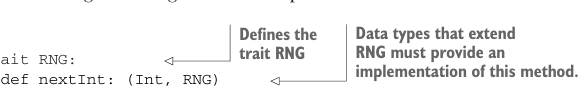
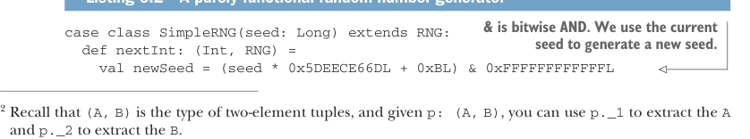

# Страница 0149
[<- Страница 0148](./page-0148) | [Индекс страниц](./) | [Страница 0150 ->](./page-0150)

> Часть 1: Введение в функциональное программирование / Глава 6: Чисто функциональное состояние / 6.2 Чисто функциональная генерация случайных чисел

вызывался определённое число раз с момента создания. Это пиздец как сложно гарантировать, потому что каждый раз, когда мы кликаем `nextInt`, например, предыдущее состояние генератора случайных чисел улетает в помойку навсегда. Теперь нам нужен отдельный механизм, чтоб считать, сколько раз мы дёргали методы на `Random`? Да ну нахуй. Ответ на весь этот бардак, конечно же, — принципиально забить на сайд-эффекты и жить без них.

### 6.2 Чисто функциональная генерация случайных чисел

Ключ к возврату референциальной прозрачности — вытащить обновления состояния на белый свет, сделать их *явными*, как в нормальном код-ревью. Не мути состояние втихаря как сайд-эффект, а просто верни новое состояние вместе с тем значением, которое нагенерил. Вот один возможный интерфейс для генератора случайных чисел — чистый, как слеза девственницы:



> Типы данных, расширяющие RNG, обязаны предоставить реализацию этого метода.

> Определяет трейт RNG

```scala
trait RNG:
def nextInt: (Int, RNG)
```

Давайте сначала глянем на определение типа данных, которое начинается с ключевого слова `trait`. Как и `enum`, ключевое слово `trait` вводит тип данных. `trait` — это абстрактный интерфейс, который может опционально содержать реализации некоторых методов. Здесь мы объявляем `trait` под именем `RNG` с единственным абстрактным методом. Метод `nextInt` должен генерить случайное `Int`; позже мы определим другие функции на базе `nextInt`. Вместо того чтоб возвращать только нагенерированное случайное число (как в классическом `scala.util.Random`) и мутировать внутреннее состояние на месте, мы возвращаем и случайное число, и новое состояние, оставляя старое нетронутым.2 По сути, мы разъединяем заботу о вычислении следующего состояния от заботы о том, чтоб донести это новое состояние до остальной программы. Никакой глобальной мутабельной памяти — просто отдаём следующее состояние обратно вызывающему. Это оставляет вызывающего `nextInt` в полном контроле: что с новым состоянием делать — его дело. Обратите внимание, мы всё равно *инкапсулируем* состояние в том смысле, что юзеры этого API нихуя не знают о реализации самого генератора. Но реализация нужна, так что берём простую. Вот базовый RNG, который юзает тот же алгоритм, что и `scala.util.Random` — это так называемый *линейный конгруэнтный генератор* (http://mng.bz/r046). Детали имплементации для нас не критичны, но заметьте: `nextInt` возвращает и генерированное значение, и новый `RNG` для следующей итерации.

Листинг 6.2 Чисто функциональный генератор случайных чисел



> & — побитовое И. Текущий сид юзаем для генерации нового сида.

```scala
case class SimpleRNG(seed: Long) extends RNG:
def nextInt: (Int, RNG) =
val newSeed = (seed * 0x5DEECE66DL + 0xBL) & 0xFFFFFFFFFFFFL
```

2 Напомню, что `(A,` `B)` — это тип двухэлементных кортежей, и если у вас есть `p: (A,` `B)`, то `p._1` вытащит `A`, а `p._2` — `B`.

[<- Страница 0148](./page-0148) | [Индекс страниц](./) | [Страница 0150 ->](./page-0150)
