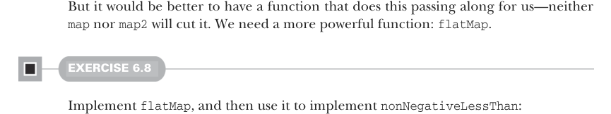
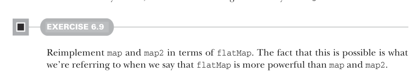

# Страница 0156

[<- Страница 0155](./page-0155) | [Индекс страниц](./) | [Страница 0157 ->](./page-0157)

> Часть 1: Введение в функциональное программирование / Глава 6: Чисто функциональное состояние / 6.4 Круче API для state-действий / 6.4.2 Вложенные state-действия

## 127 6.4 Круче API для state-действий

```scala
def nonNegativeLessThan(n: Int): Rand[Int] =
  rng =>
    val (i, rng2) = nonNegativeInt(rng)
    val mod = i % n
    if i + (n-1) - mod >= 0 then
      (mod, rng2)
    else
      nonNegativeLessThan(n)(rng2)
```



Но было бы пиздец как удобнее иметь функцию, которая сама этот стейт по цепочке таскает — ни `map`, ни `map2` тут не прокатят, как велик против танка. Нам нужна настоящая пушка: `flatMap`.

#### УПРАЖНЕНИЕ 6.8

Реализуй `flatMap`, а потом на её основе `nonNegativeLessThan`:

```scala
def flatMap[A, B](
  r: Rand[A]
)(f: A => Rand[B]): Rand[B]
```

`flatMap` позволяет нагенерить рандомный `A` через `Rand[A]`, а потом взять эту хуйню-`A` и на её основе выбрать `Rand[B]` — типа, решать на лету, как в жизни, блядь. В `nonNegativeLessThan` юзаем её, чтоб выбрать, ретраить или нахуй послать, смотря на то, что `nonNegativeInt` выдал.



#### УПРАЖНЕНИЕ 6.9

Перепиши `map` и `map2` через `flatMap`. То, что это вообще возможно, и есть суть, когда мы говорим, что `flatMap` — это как Docker против голой VM (virtual machine): мощнее, чем `map` и `map2`, и всех их поглощает.

Теперь вернёмся к тому примеру с начала главы, который я сам через такое дерьмо пропёрся. Можем ли мы сделать бросок кубика, который реально тестировать без геморроя, с нашим чисто функциональным API? Вот реализация `rollDie` через `nonNegativeLessThan`, включая ту классическую off-by-one хуйню (ошибку на единицу), что была раньше:

```scala
def rollDie: Rand[Int] = nonNegativeLessThan(6)
```

Если потестируем эту функцию с разными `RNG`-стейтами, то быстро выловим `RNG`, который заставит её вернуть `0`:

```scala
scala> val zero = rollDie(SimpleRNG(5))._1
val zero: Int = 0
```

А воспроизвести это стабильно — раз плюнуть, юзая тот же `SimpleRNG(5)` рандом-генератор, без паранойи, что стейт после использования в жопу улетит. Фикс бага — вообще тривиал, как патч на понедельник:

```scala
def rollDie: Rand[Int] = map(nonNegativeLessThan(6))(_ + 1)
```

[<- Страница 0155](./page-0155) | [Индекс страниц](./) | [Страница 0157 ->](./page-0157)
