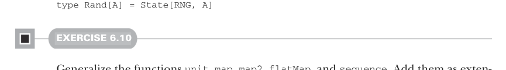

# Страница 0158
[<- Страница 0157](./page-0157) | [Индекс страниц](./) | [Страница 0159 ->](./page-0159)

> Часть 1: Введение в функциональное программирование / Глава 6: Чисто функциональный стейт / 6.6 Чисто функциональное императивное программирование

## 129 6.6 Чисто функциональное императивное программирование (Purely functional imperative programming)

Как и в версии с `case class`, `opaque type` (непрозрачный тип) даёт коллегам отдельный тип, чтоб не путать голую функцию с `State[S, A]` значением — это ж классический подвох, где всё сливается в одну кучу. А как и `type alias` (псевдоним типа), `opaque` избегает рантайм-оверхеда от оборачивания функции в объект. За цену пары boilerplate-конверсий получаем и инкапсуляцию, и перфоманс на уровне. `Case class` wrapper кидает лишнюю аллокацию объекта на каждый `State`, а `opaque` — ни хуя. Но в реальных программах эта аллокация — полная хуйня, GC в JVM и прочих рантаймах жрёт такое на завтрак, не моргнув. Не ссыте юзать простой `case class`, а на `opaque` рефакторите только если аллокации реально душат перф в профайлере. Какой репрезентацию выберете — похуй по большому счёту, все варианты норм. Главное, что у нас один универсальный тип, и на нём лепим универсальные функции, чтоб ловить типичные паттерны стейтфул-программ. Теперь можем сделать `Rand` псевдонимом типа (`type alias`) для `State`:



```scala
type Rand[A] = State[RNG, A]
```

#### УПРАЖНЕНИЕ 6.10

Обобщите функции `unit`, `map`, `map2`, `flatMap` и `sequence`. Добавьте их как extension methods на тип `State`, где это возможно. Иначе запихните в companion object `State`.

Функции, что мы тут налепили, ловят только самую ходовую мелочь. Пиша больше функционального кода, нарвётесь на другие паттерны и слепите свои функции под них — это как в продакшене, сам через это прошёл.

### 6.6 Чисто функциональное императивное программирование

В предыдущих секциях мы слепили функции по чёткому паттерну: запускаем state action, результат в `val`, следующий action жрёт эту `val`, его результат в `val`, и так далее. Выглядит как классическая *императивка* (imperative programming), где программа — цепочка statements (инструкций), каждый из которых может насрать в стейт. Именно это мы и мутим, только statements — это `State` actions (действия), по сути чистые функции. Они стейт читают из аргумента, как нормальный FP, а пишут — возвращая новое значение. Собрали `map`, `map2` и в итоге `flatMap`, чтоб стейт перекидывать от одного statement'а к другому. Но в процессе чуть потеряли тот самый императивный вайб, как будто FP пытается притвориться C-подобным, но с подколом.

[<- Страница 0157](./page-0157) | [Индекс страниц](./) | [Страница 0159 ->](./page-0159)
