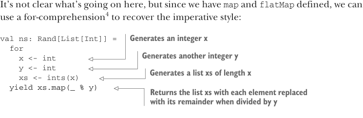

# Страница 0159
[<- Страница 0158](./page-0158) | [Индекс страниц](./) | [Страница 0160 ->](./page-0160)

> Часть 1: Введение в функциональное программирование / Глава 6: Чисто функциональное состояние / 6.6 Чисто функциональное императивное программирование


Разве императивное и функциональное программирование — это полные антагонисты, как кот и собака в мемах? Да хуйня полная! Императивка и функционалка никак не противоположности. Вспомни: функциональное — это просто код без побочек, чистый, как слеза девственницы. А императивное — это когда ты через команды мутишь состояние программы, и как мы уже видели, держать состояние без побочек — это вполне разумно, без всякой хуйни.

Функционалка даёт офигенную поддержку для императивных программ, плюс жирный бонус: их можно рассуждать уравнениями, потому что они референциально прозрачны — подставь значение вместо переменной, и ничего не сломается. Про уравнительное рассуждение про коды ещё наговорим в части 2, а про императивку конкретно — в 3-й и 4-й.

Возьми пример (предполагая, что мы сделали `Rand[A]` синонимом для `State[RNG,` `A]`):

> int — это значение типа Rand[Int], которое генерит один рандомный инт.

```scala
val ns: Rand[List[Int]] =
int.flatMap(x =>
int.flatMap(y =>
ints(x).map(xs =>
```

> ints(x) генерит список длины x.

```scala
xs.map(_ % y))))
```

> Заменяет каждый элемент списка на его остаток от деления на y

Не сразу въедешь, что тут творится, но раз у нас есть `map` и `flatMap`, то for-comprehension^4 вернёт нам императивный стиль, как по маслу:



> Генерит инт x

```scala
val ns: Rand[List[Int]] =
for
x <- int
y <- int
xs <- ints(x)
yield xs.map(_ % y)
```

> Генерит ещё один инт y

> Генерит список xs длины x

> Возвращает список xs, где каждый элемент заменён на остаток от деления на y

Этот код читать (и писать) в разы проще, и выглядит как есть: императивная хрень, которая держит состояние. Но это тот же самый код, блядь! Берём следующий `Int` и присваиваем в `x`, потом следующий `Int` в `y`, генерим список длины `x` и наконец возвращаем его с элементами по модулю `y`. Чтобы такая императивка на for-comprehensions (или `flatMaps`) работала, нам реально нужны всего два примитивных конструктора `State`: один для чтения состояния и один для записи. Представь, что у нас есть конструктор `get` для получения текущего состояния и `set` для установки нового — тогда можно слепить конструктор, который мутирует состояние как угодно:

^4 Помни, for-comprehensions — это сахарный синтаксис для цепочки вызовов `flatMap` с финальным `map`. См. раздел про for-comprehensions в главе 4.

[<- Страница 0158](./page-0158) | [Индекс страниц](./) | [Страница 0160 ->](./page-0160)
