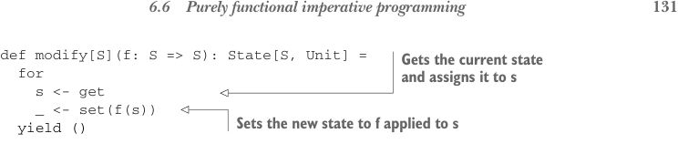
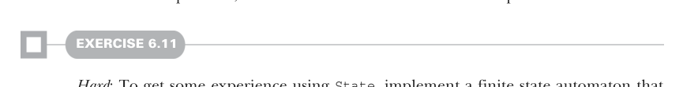

# Страница 0160

[<- Страница 0159](./page-0159) | [Оглавление страниц](./) | [Страница 0161 ->](./page-0161)

> Часть 1: Введение в функциональное программирование / Глава 6: Чисто функциональное состояние / 6.6 Чисто функциональное императивное программирование



## 131 6.6 Чисто функциональное императивное программирование

```scala
def modify[S](f: S => S): State[S, Unit] =
for
s <- get
_ <- set(f(s))
yield ()
```

> Берёт текущее состояние и присваивает его переменной `s`.
>
> Устанавливает новое состояние как результат применения `f` к `s`.

Этот конструктор<sup>5</sup> возвращает действие типа `State`, которое меняет входящее состояние с помощью функции `f`. Оно отдаёт `Unit`, чтоб сразу было ясно: никакого возвращаемого значения, кроме самого состояния, тут нет. А как выглядят `get` и `set`? Блять, проще некуда, пацаны. `get` просто пропускает входящее состояние дальше и возвращает его как есть — как эстафетная палочка в руках у бегуна, который не меняет ничего:

```scala
def get[S]: State[S, S] = s => (s, s)
```

А `set` конструируется с новым состоянием `s`. Получившееся действие плюёт на входящее состояние, подставляет новое и вместо нормального значения возвращает `()` — чистый unit, чтоб не путаться:

```scala
def set[S](s: S): State[S, Unit] = _ => ((), s)
```

Эти две простые хуйни плюс функции `State`, которые мы накатали — `unit`, `map`, `map2` и `flatMap` — и есть весь арсенал, чтоб закодить любой конечный автомат (state machine) или программу с состоянием (stateful программу) чисто функционально. Забудьте про мутабельные структуры и сайд-эффекты — у нас неменяемые (immutable) данные и функции, которые вычисляют следующее состояние из предыдущего, а `State` просто сдирает всю эту обёртку из котельного кода (boilerplate), как шкурку с банана.



#### УПРАЖНЕНИЕ 6.11

*Сложное*: Чтоб набить руку на `State`, реализуйте конечный автомат, который моделирует простой автомат по продаже конфет. Машина принимает два типа ввода: кидаешь монету или крутишь ручку, чтоб выдать конфету. Она может быть в двух состояниях: заперта или открыта. Плюс трекает, сколько конфет осталось и сколько монет внутри:

```scala
enum Input:
case Coin, Turn
case class Machine(locked: Boolean, candies: Int, coins: Int)
```

Правила такие, короче:

- Кидаешь монету в запертую машину — она откроется, если конфет ещё есть.


- Крутишь ручку на открытой машине — выдаст конфету и запрётся снова.

<sup>5</sup> Иногда термин *constructor* (конструктор) используют для функции, которая создаёт значение определённого типа. Не путайте это с объектно-ориентированным понятием конструктора класса, который Scala тоже поддерживает.

[<- Страница 0159](./page-0159) | [Оглавление страниц](./) | [Страница 0161 ->](./page-0161)
