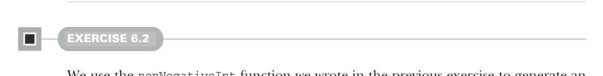

# Страница 0162
[<- Страница 0161](./page-0161) | [Индекс страниц](./) | [Страница 0163 ->](./page-0163)

> Часть 1: Введение в функциональное программирование / Глава 6: Чисто функциональное состояние / 6.8 Ответы на упражнения

## 133 6.8 Ответы на упражнения

- `State` (State[S, A]) поддерживает те же операции, что и `Rand` (Rand), — `unit` (unit), `map` (map), `map2` (map2), `flatMap` (flatMap) и `sequence` (sequence), — потому что ни одна из них не завязана жестко на том, что тип состояния — именно `Rng` (Rng). Как универсальный джойстик, который работает с любой RNG-подобной хренью.

- Тип данных `State` (State) упрощает жизнь с API, которые на вид мутабельные, избавляя от ручной протаскивания входного и выходного состояния через всю цепочку вычислений. Больше не нужно, как в старом добром императивном аду, вручную сшивать стейт в каждую функцию — чистый FP-релакс.

- Вычисления с состоянием лепятся через for-comprehensions (for-выражения), и код на выходе выглядит как императивный сахарный сироп, но под капотом — чистая монада, пацаны. Идеально для тех, кто соскучился по `while`-петлям, но не хочет тонуть в мутабельности.


### 6.8 Ответы на упражнения

#### УПРАЖНЕНИЕ 6.1

```scala
def nonNegativeInt(rng: RNG): (Int, RNG) =
val (i, r) = rng.nextInt
(if i < 0 then -(i + 1) else i, r)
```

Сначала дёргаем `rng.nextInt`, чтоб сгенерить инт от `Int.MinValue` до `Int.MaxValue`.  
Распаковываем тюпл на две части: `i` — это наша рандомная добыча, а `r` — следующий `RNG`, чтоб цепочку не рвать.  
Если `i` не в минусе (нуль или плюс) — смело возвращаем, как есть.  
А если ушёл в отрицалово — плюсуем единицу и флипаем знак.  
Не ссыте, это не портит равномерность генерации: в диапазоне от `[Int.MinValue, -1]` ровно столько же чисел, сколько от `[0, Int.MaxValue]`.  
В любом случае, цепляем результат к следующему `RNG` — и вперёд.



#### УПРАЖНЕНИЕ 6.2

Берём функцию `nonNegativeInt` из прошлого упражнения, чтоб выдать инт в диапазоне от `[0, Int.MaxValue]`.  
Потом делим это значение на `Int.MaxValue + 1`, чтоб подогнать под нужный интервал.  
Опять же, не забываем спарить результат с следующим `RNG` — стейт не теряем:

```scala
def double(rng: RNG): (Double, RNG) =
val (i, r) = nonNegativeInt(rng)
(i / (Int.MaxValue.toDouble + 1), r)
```


#### УПРАЖНЕНИЕ 6.3

Давайте сперва заимплиментируем `intDouble` (intDouble):

```scala
def intDouble(rng: RNG): ((Int, Double), RNG) =
val (i, r1) = rng.nextInt
val (d, r2) = double(r1)
((i, d), r2)
```

[<- Страница 0161](./page-0161) | [Индекс страниц](./) | [Страница 0163 ->](./page-0163)
