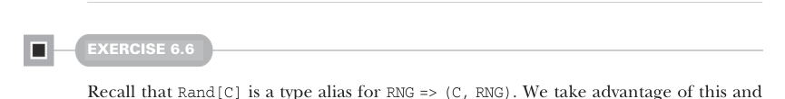

# Страница 0164
[<- Страница 0163](./page-0163) | [Индекс страниц](./) | [Страница 0165 ->](./page-0165)

> Часть 1: Введение в функциональное программирование / Глава 6: Чисто функциональное состояние / 6.8 Ответы на упражнения

## 135 Ответы на упражнения 6.8

Втискиваем этот результат в свежеиспечённое целое число и новый `RNG`. Дальше рекурсивно дёргаем `go`, сбрасывая счётчик на единицу, и пихаем туда последний `RNG` плюс cons'нутый инт в нашу кучу чисел. Кстати, список, который выдаст эта хрень, будет в обратном порядке — вверх тормашками по сравнению с оригинальной, не хвостовой рекурсией. Хотите порядок поправить, как нормальные люди? В теле `ints` после возврата `go` просто ревертните выходной список, и привет.


#### УПРАЖНЕНИЕ 6.5

В исходном `double` торчали два главных хуя: слепить дабл (double) из вычисленного неотрицательного инта и ебаться с `RNG` — пихать его в `nonNegativeInt`, матчить результат паттернами и потом собирать финальный тюпл (tuple) заново, как конструктор Лего. А с `map` над `nonNegativeInt` сидишь чисто на конвертере int в double, а всю рандомную бухгалтерию `map` сам разрулит, без твоих соплей:

```scala
val double: Rand[Double] =
  map(nonNegativeInt)(i => i / (Int.MaxValue.toDouble + 1))
```



#### УПРАЖНЕНИЕ 6.6

Вспомни, `Rand[C]` — это алиас для `RNG => (C, RNG)`, чистый сахар. Пользуясь этим, возвращаем анонимку такого типа. Берём входящий `rng0`, дёргаем `ra` — бац, `A` в кармане плюс свежий `RNG`. То же с `rb`, но блядь осторожно: хватаем `RNG` именно от `ra`, а не тот заезженный `rng0` из параметров анонимки, чтоб не наебать рандом. Наконец, кидаем сгенеренные `A` и `B` в `f`, паруим результат с `RNG` от `rb` — и вуаля:

```scala
def map2[A, B, C](ra: Rand[A], rb: Rand[B])(f: (A, B) => C): Rand[C] =
  rng0 =>
    val (a, rng1) = ra(rng0)
    val (b, rng2) = rb(rng1)
    (f(a, b), rng2)
```

В определении `map2` болтается три разных `RNG`: `rng0`, `rng1` и `rng2`. Приходилось пиздец как бдить, чтоб в каждом месте хватать правильный, а то рандомность сдохнет, как кот Шрёдингера в коробке. Когда пишешь `Rand` через анонимки, такая error-prone (ошибкоопасная) бухгалтерия — классический пиздец, все через это проходят. Поэтому лучше запихивать всю эту хуйню в обобщения (generics) вроде `map2`, чтоб логику было проще въехать, проверить и не сойти с ума на код-ревью.

[<- Страница 0163](./page-0163) | [Индекс страниц](./) | [Страница 0165 ->](./page-0165)
